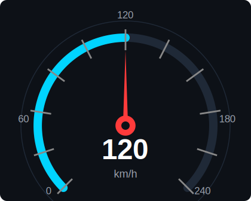
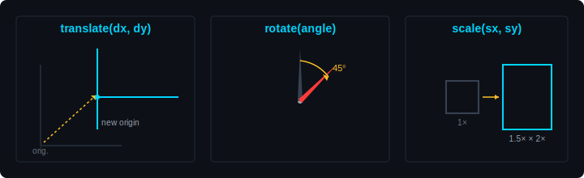

# Module 04 — QPainter Custom Drawing

> Take Qt beyond stock widgets. Learn how to paint your own gauges, needles, arcs, and warning icons with QPainter — the same technology that powers every custom-looking automotive cluster.

| Phase | Level | Time | Qt modules |
| --- | --- | --- | --- |
| Phase 2 — Intermediate Qt | Intermediate | 3 hours | Qt Core · Qt GUI · Qt Widgets |

---

## Table of Contents

1. [Why QPainter Matters](#1-why-qpainter-matters)
2. [QPainter in Automotive HMIs](#2-qpainter-in-automotive-hmis)
3. [The Mechanism — `paintEvent` and `QPainter`](#3-the-mechanism--paintevent-and-qpainter)
4. [Drawing Primitives — Lines, Rectangles, Arcs, Text](#4-drawing-primitives--lines-rectangles-arcs-text)
5. [Pens, Brushes, and Colors](#5-pens-brushes-and-colors)
6. [Transformations — Translate, Rotate, Scale](#6-transformations--translate-rotate-scale)
7. [Antialiasing and Render Hints](#7-antialiasing-and-render-hints)
8. [When to Repaint — `update()` vs `repaint()`](#8-when-to-repaint--update-vs-repaint)
9. [Official Documentation Map](#9-official-documentation-map)
10. [Reference Videos](#10-reference-videos)
11. [Common Errors & Fixes](#11-common-errors--fixes)

---

## 1. Why QPainter Matters

Every Qt widget on screen — the buttons, labels, sliders you used in Module 02 — eventually calls `QPainter` to draw itself. You normally don't see it because Qt's stock widgets handle their own painting. But the moment you need something Qt doesn't ship out of the box — a circular speedometer needle, a sweeping fuel arc, a custom warning triangle that pulses red — you take over the brush and paint it yourself.

`QPainter` is Qt's 2D drawing API. It draws lines, shapes, text, gradients, and images onto any **paint device** — a widget, an image in memory, a printer, even a PDF. For HMI work the paint device is almost always a widget, and the drawing happens inside the widget's `paintEvent()` function.

Two things make this powerful:

- **It's vector-based.** You describe shapes mathematically (an arc from 0° to 270°, a polygon of five points), and Qt renders them crisply at any resolution. The same code looks sharp on a 7-inch cluster and a 15-inch passenger display.
- **It composes.** Pens for outlines, brushes for fills, transformations for rotation/scale, clip regions for masking — you build complex visuals by combining simple primitives.

If Module 02 taught you to assemble pre-built widgets and Module 03 taught you to wire them together, QPainter is what lets you build the *visuals* that don't exist in the stock catalog.

---

## 2. QPainter in Automotive HMIs

The visual goal of this module — a speedometer like this, fully custom-painted, every line of which is a QPainter call:

  

Look at any modern instrument cluster. The dial faces, sweeping needles, gradient arcs, custom warning glyphs, fuel-level pictograms — almost none of those are stock Qt widgets. They're custom-painted with `QPainter` inside subclasses of `QWidget`.

| Cluster element | What QPainter draws |
| --- | --- |
| Speedometer dial face | Concentric circles, tick marks, numeric labels at angles |
| Speedometer needle | Rotated polygon or thin polygon path |
| RPM arc with red zone | Two arcs — one green/white, one red — overlapping |
| Fuel gauge | Filled rounded rectangle that shrinks as fuel drops |
| Battery level (EV) | Battery-shape outline + filled bar inside |
| Turn-signal arrows | Polygon path filled green, blinked with QTimer |
| ADAS warning triangle | Polygon + exclamation glyph, pulses by changing alpha |
| Drive-mode badge | Gradient-filled rounded rectangle with text |
| Range/odometer digits | Custom font rendered with `drawText()` |

The pattern is identical for all of them:

1. Subclass `QWidget`.
2. Override `paintEvent(QPaintEvent *)`.
3. Inside, create a `QPainter`, set pens/brushes, call `drawLine`, `drawArc`, `drawText`, etc.
4. Call `update()` whenever the underlying value (speed, fuel, RPM) changes — Qt schedules a repaint.

A real cluster is often just **5–10 of these custom widgets** arranged in a `QGridLayout`. That's it. The skill in this module is everything that happens inside one `paintEvent`.

---

## 3. The Mechanism — `paintEvent` and `QPainter`

Every `QWidget` has a virtual function:

    virtual void paintEvent(QPaintEvent *event);

Qt calls this whenever the widget needs to redraw — the first time it appears, when it's resized, when another window uncovers it, or when *you* request a repaint with `update()`. You override it to take control of what gets drawn.

Inside `paintEvent`, you create a **`QPainter`** bound to the widget (`this`), issue drawing commands, and let the painter's destructor flush them when the function returns.

The smallest possible custom widget — draws a red circle filling itself:

    class Dot : public QWidget {
        Q_OBJECT
    public:
        explicit Dot(QWidget *parent = nullptr) : QWidget(parent) {}

    protected:
        void paintEvent(QPaintEvent *) override {
            QPainter p(this);
            p.setRenderHint(QPainter::Antialiasing);
            p.setBrush(Qt::red);
            p.setPen(Qt::NoPen);
            p.drawEllipse(rect());     // fill the entire widget area
        }
    };

`rect()` returns the widget's drawing area as a `QRect` — usually `(0, 0, width, height)`. You'll use it constantly.

What ends up on screen:

    ┌─────────────┐
    │   ●●●●●●●   │
    │ ●●●●●●●●●●● │
    │●●●●●●●●●●●●●│
    │ ●●●●●●●●●●● │
    │   ●●●●●●●   │
    └─────────────┘

That's the entire mental model. Everything else in this module is just *what* you draw inside `paintEvent`.

> 📘 **Reference:** [QPainter (Qt 6.1)](https://doc.qt.io/archives/qt-6.1/qpainter.html) · [Paint System (Qt 6.1)](https://doc.qt.io/archives/qt-6.1/paintsystem.html)

---

## 4. Drawing Primitives — Lines, Rectangles, Arcs, Text

`QPainter` exposes a few dozen drawing functions. You'll use about ten of them every day. Here are the ones that build 90 % of an HMI.

### Lines and rectangles

    p.drawLine(10, 10, 100, 10);            // horizontal line
    p.drawRect(20, 20, 60, 40);             // outlined rectangle
    p.fillRect(20, 20, 60, 40, Qt::yellow); // filled rectangle, no outline
    p.drawRoundedRect(20, 20, 60, 40, 8, 8); // rounded corners

### Ellipses and arcs

The workhorse for any circular gauge. `drawArc` takes a bounding rectangle and two angles **measured in sixteenths of a degree** — Qt's odd legacy convention.

    p.drawEllipse(QPoint(50, 50), 40, 40);   // circle, centre + radii
    p.drawArc(10, 10, 80, 80,                // arc inside this rect
              30 * 16,                       // start angle: 30°
              120 * 16);                     // span angle: 120°

Mnemonic: any time you write an angle for `drawArc`, multiply by 16. Forget it once and your arc is a tenth the size you expected.

### Polygons — needles and arrows

A speedometer needle is just a thin triangle (or kite shape) drawn with `drawPolygon`:

    QPolygon needle;
    needle << QPoint( 0, -90)   // tip
           << QPoint(-4,   0)   // left base
           << QPoint( 0,  10)   // tail
           << QPoint( 4,   0);  // right base
    p.setBrush(Qt::white);
    p.drawPolygon(needle);

(Drawn around the origin so you can rotate it with `p.rotate(angle)` — see §6.)

### Text

`drawText` accepts a position or a bounding rectangle. The rectangle form is what you want for centred labels like the giant speed digits:

    p.setPen(Qt::white);
    p.setFont(QFont("Roboto", 64, QFont::Bold));
    p.drawText(rect(), Qt::AlignCenter, "120");

### Images and icons

For pre-rendered glyphs — warning triangles, brand logos — load a `QPixmap` once (preferably from a `.qrc` resource) and draw it positioned:

    QPixmap warning(":/icons/warning.png");
    p.drawPixmap(20, 20, warning);

> 📘 **Reference:** [QPainter drawing functions (Qt 6.1)](https://doc.qt.io/archives/qt-6.1/qpainter.html#drawing-functions) · [QPolygon (Qt 6.1)](https://doc.qt.io/archives/qt-6.1/qpolygon.html) · [QPainterPath (Qt 6.1)](https://doc.qt.io/archives/qt-6.1/qpainterpath.html)

---

## 5. Pens, Brushes, and Colors

Two settings on the painter control what every shape looks like:

- **Pen** — the outline. Colour, thickness, dash pattern, line cap.
- **Brush** — the fill. Solid colour, gradient, texture, or `Qt::NoBrush` for outline-only.

Set them once, draw many shapes, change them, draw more.

    QPen pen(QColor("#00d4ff"));
    pen.setWidth(3);
    pen.setCapStyle(Qt::RoundCap);
    p.setPen(pen);

    p.setBrush(QColor("#1a1a1a"));
    p.drawRoundedRect(10, 10, 200, 60, 12, 12);

### Gradients — the automotive HMI staple

Almost every modern cluster uses gradients for arcs and bars. Two flavours:

    // Linear — top to bottom fade
    QLinearGradient grad(0, 0, 0, height());
    grad.setColorAt(0.0, QColor("#00ffaa"));
    grad.setColorAt(1.0, QColor("#003322"));
    p.setBrush(grad);
    p.drawRect(rect());

    // Radial — used for glow effects on warning icons
    QRadialGradient glow(centre, 50);
    glow.setColorAt(0.0, QColor(255, 80, 80, 200));   // bright centre
    glow.setColorAt(1.0, QColor(255, 80, 80,   0));   // transparent edge
    p.setBrush(glow);
    p.drawEllipse(centre, 50, 50);

### Color shortcuts

Use `Qt::red`, `Qt::black`, `Qt::transparent` for quick prototyping. For real HMI colours use hex strings (`QColor("#00d4ff")`) or RGBA (`QColor(255, 80, 80, 200)` — the fourth value is alpha 0–255 for transparency).

> 📘 **Reference:** [QPen (Qt 6.1)](https://doc.qt.io/archives/qt-6.1/qpen.html) · [QBrush (Qt 6.1)](https://doc.qt.io/archives/qt-6.1/qbrush.html) · [QLinearGradient (Qt 6.1)](https://doc.qt.io/archives/qt-6.1/qlineargradient.html) · [QColor (Qt 6.1)](https://doc.qt.io/archives/qt-6.1/qcolor.html)

---

## 6. Transformations — Translate, Rotate, Scale

This is what makes a needle *rotate*. Instead of recalculating the polygon coordinates for every angle, you draw the needle once at angle 0 and let `QPainter` rotate the coordinate system.

  

Three operations, all stackable:

    p.translate(centreX, centreY);   // move origin to the centre of the gauge
    p.rotate(needleAngle);           // rotate around the new origin
    p.scale(1.0, 1.0);               // (optional) zoom

Then draw the needle as if it were always pointing up — Qt handles the rotation.

### Save / restore the painter state

Once you start translating and rotating, you'll forget where the origin is. Wrap each independent drawing in `save()` / `restore()`:

    void Speedometer::paintEvent(QPaintEvent *) {
        QPainter p(this);
        p.setRenderHint(QPainter::Antialiasing);

        const QPoint centre = rect().center();

        // 1. Draw the dial face in the default coordinate system
        p.setBrush(Qt::black);
        p.drawEllipse(centre, 100, 100);

        // 2. Draw the needle — isolated transformations
        p.save();
            p.translate(centre);
            p.rotate(speedToAngle(m_speed));   // -135° at 0 km/h, +135° at max
            p.setBrush(Qt::red);
            QPolygon needle;
            needle << QPoint(0, -90) << QPoint(-3, 0) << QPoint(3, 0);
            p.drawPolygon(needle);
        p.restore();

        // 3. Draw the digital readout — back in original coordinates
        p.setPen(Qt::white);
        p.setFont(QFont("Roboto", 24, QFont::Bold));
        p.drawText(rect(), Qt::AlignCenter, QString::number(m_speed));
    }

That's the skeleton of a real speedometer. Everything else is tuning angles, colours, and tick marks.

> 📘 **Reference:** [Coordinate System (Qt 6.1)](https://doc.qt.io/archives/qt-6.1/coordsys.html) · [QPainter transformations](https://doc.qt.io/archives/qt-6.1/qpainter.html#transformations)

---

## 7. Antialiasing and Render Hints

By default, `QPainter` renders fast and pixelated — fine for desktop forms, ugly for automotive HMIs. Turn on antialiasing in *every* custom paint event:

    p.setRenderHint(QPainter::Antialiasing);            // smooth shape edges
    p.setRenderHint(QPainter::SmoothPixmapTransform);   // smooth scaled images
    p.setRenderHint(QPainter::TextAntialiasing);        // smooth fonts

Without these, your speedometer needle will have visible stair-stepping along its edges. With them, it looks like a real instrument.

Performance cost is small for typical HMI shapes (10–50 primitives per repaint). Profile only if you're painting hundreds of objects per frame.

> 📘 **Reference:** [QPainter::RenderHint (Qt 6.1)](https://doc.qt.io/archives/qt-6.1/qpainter.html#RenderHint-enum)

---

## 8. When to Repaint — `update()` vs `repaint()`

Your widget paints once when shown. To redraw it when the data changes (speed updated, fuel dropped) you need to ask Qt to call `paintEvent` again. Two ways:

    update();    // schedules a repaint — coalesces multiple calls, runs on next event loop turn
    repaint();   // forces a repaint right now — synchronous, blocks the calling thread

**Always prefer `update()`.** It's safer, faster overall, and lets Qt merge multiple update requests into one actual repaint. `repaint()` is rarely needed — only when you must redraw *before* the next line of code runs (e.g. you're about to take a screenshot).

Typical flow in an HMI:

    void Speedometer::setSpeed(int kmh) {
        if (kmh == m_speed) return;     // no change → no repaint
        m_speed = kmh;
        update();                        // schedule one repaint
        emit speedChanged(kmh);
    }

The `if (kmh == m_speed) return` guard is the same redundancy-gate trick from Module 03 — protects against a sensor that streams the same number 50 times a second.

> 📘 **Reference:** [QWidget::update (Qt 6.1)](https://doc.qt.io/archives/qt-6.1/qwidget.html#update) · [QWidget::repaint (Qt 6.1)](https://doc.qt.io/archives/qt-6.1/qwidget.html#repaint)

---

## 9. Official Documentation Map

Bookmark these — every link is the **Qt 6.1** version (same pages exist under `doc.qt.io/qt-5/...` for Qt 5.15).

### Core painting

| Resource | What it gives you |
| --- | --- |
| [QPainter](https://doc.qt.io/archives/qt-6.1/qpainter.html) | Master reference — every drawing function |
| [Paint System Overview](https://doc.qt.io/archives/qt-6.1/paintsystem.html) | How Qt's painting actually works under the hood |
| [Coordinate System](https://doc.qt.io/archives/qt-6.1/coordsys.html) | Origin, axes, transformations explained |

### Pens, brushes, paths

| Resource | What it gives you |
| --- | --- |
| [QPen](https://doc.qt.io/archives/qt-6.1/qpen.html) · [QBrush](https://doc.qt.io/archives/qt-6.1/qbrush.html) | Outline and fill configuration |
| [QPainterPath](https://doc.qt.io/archives/qt-6.1/qpainterpath.html) | Reusable complex shapes (curves, multi-segment paths) |
| [QLinearGradient](https://doc.qt.io/archives/qt-6.1/qlineargradient.html) · [QRadialGradient](https://doc.qt.io/archives/qt-6.1/qradialgradient.html) | Gradient fills |

### Worked examples

| Resource | What it gives you |
| --- | --- |
| [Analog Clock Example](https://doc.qt.io/archives/qt-6.1/qtwidgets-widgets-analogclock-example.html) | The canonical "rotate a needle" example — read this first |
| [Painter Paths Example](https://doc.qt.io/archives/qt-6.1/qtwidgets-painting-painterpaths-example.html) | Building complex shapes |
| [Transformations Example](https://doc.qt.io/archives/qt-6.1/qtwidgets-painting-transformations-example.html) | Visualises translate/rotate/scale |
| [Concentric Circles Example](https://doc.qt.io/archives/qt-6.1/qtwidgets-painting-concentriccircles-example.html) | Antialiasing comparison |

---

## 10. Reference Videos

Watch the first two before opening your editor.

| Video | Length | Why watch |
| --- | --- | --- |
| [Qt QPainter Basics — Drawing Shapes in C++](https://www.youtube.com/watch?v=GFLlnYzMnQc) | ~15 min | First custom paintEvent, shapes and colours |
| [Custom Widgets with QPainter — Step by Step](https://www.youtube.com/watch?v=_RUkpZAh1Vs) | ~20 min | Building a custom widget from scratch |
| [Building an Analog Clock with QPainter](https://www.youtube.com/watch?v=HVL4Yz0oqYM) | ~25 min | The classic rotation example, end to end |
| [Qt Painting & Animation Crash Course](https://www.youtube.com/watch?v=h_DVfsD9PKI) | ~20 min | Pens, brushes, gradients, transformations |
| [Speedometer Widget in Qt — Full Build](https://www.youtube.com/watch?v=DK7Yc7i-tb4) | ~30 min | Automotive-relevant — applies everything in this module |

---

## 11. Common Errors & Fixes

The things that bite every Qt newcomer when working with `QPainter`.

### `QPainter::begin: Paint device returned engine == 0`

You created a `QPainter` outside `paintEvent` and pointed it at a widget. Qt only lets you paint a widget inside its own `paintEvent`. **Fix:** move all painter creation into `paintEvent(QPaintEvent *)`. If you need to paint into something independent, paint into a `QPixmap` or `QImage` instead and `drawPixmap` it in the paint event.

### `QWidget::paintEngine: Should no longer be called`

Same root cause — trying to paint a widget from somewhere other than its `paintEvent`. **Fix:** same as above.

### My widget is blank / I see nothing

Three usual causes:

1. You forgot to override `paintEvent` (or misspelled it — Qt won't warn you).
2. You set the pen to `Qt::NoPen` *and* the brush to `Qt::NoBrush` — Qt happily draws nothing.
3. Your drawing coordinates are outside the widget's `rect()` — translate them or check `width()` / `height()` aren't zero.

### Shapes are pixelated / jagged

You didn't enable antialiasing. **Fix:** `p.setRenderHint(QPainter::Antialiasing);` at the top of every `paintEvent`. Add `TextAntialiasing` if your text looks rough too.

### `drawArc` produces the wrong size or wrong angle

You forgot Qt's `× 16` convention for arc angles. **Fix:** every angle passed to `drawArc`, `drawChord`, `drawPie` must be multiplied by 16. `drawArc(rect, 0, 90 * 16)` for a quarter circle.

### Needle rotates but the dial face rotates with it

You translated/rotated the painter and then drew everything afterwards in the rotated coordinate system. **Fix:** wrap the rotating content in `p.save()` / `p.restore()` so the transformation doesn't leak into subsequent draws.

### Widget doesn't repaint when I change the value

You forgot to call `update()` in your setter. Changing a member variable doesn't automatically redraw — Qt has no idea you changed anything. **Fix:** add `update();` at the end of any function that modifies data the paint event reads.

### Repaints are fast for small widgets but slow when widget gets big

You're redrawing the entire widget every time even when only a small region changed. **Fix:** for advanced cases, use the `QPaintEvent::region()` or `rect()` to repaint only the dirty area. For typical HMI widgets (≤ 500 × 500 px) the default full-repaint is fine.

### `setPen` and `setBrush` from a previous paint call seem to "leak" between widgets

They don't — each `QPainter` is local to its `paintEvent` and gone when the function returns. If colours look wrong, you set them somewhere inside this `paintEvent` and forgot. Use `save()`/`restore()` or just re-set the pen/brush before each shape.

### Build error: `'QPainter' was not declared in this scope`

Missing include. Add `#include <QPainter>` at the top of the implementation file. Same goes for `QPen`, `QBrush`, `QLinearGradient`, etc. — each is its own header in Qt 6.

### Stylesheets work on my custom widget *except* the background

`QWidget` subclasses that override `paintEvent` ignore stylesheets by default. **Fix:** at the top of `paintEvent`, paint the stylesheet background manually:

    QStyleOption opt;
    opt.initFrom(this);
    style()->drawPrimitive(QStyle::PE_Widget, &opt, &p, this);

Then continue with your custom drawing on top.

---

## What's next

Once you can paint a static gauge, you need to make it *move*. That's **[Module 05 — QTimer & Real-time Updates](https://github.com/ManeParag/Qt_Automotive_Training/blob/main/05-qtimer-and-realtime-updates)** *(coming soon)* — driving paintable widgets from periodic timers, animation loops, and (when QTimer isn't enough) background threads.

A worked sample project — a complete speedometer widget driven by a simulated speed source — will live in a subfolder next to this README.

---

← [Previous module](https://github.com/ManeParag/Qt_Automotive_Training/blob/main/03-signals-and-slots) · [Back to syllabus](https://github.com/ManeParag/Qt_Automotive_Training/blob/main/README.md) · [Next module →](https://github.com/ManeParag/Qt_Automotive_Training/blob/main/05-qtimer-and-realtime-updates) *(coming soon)*
