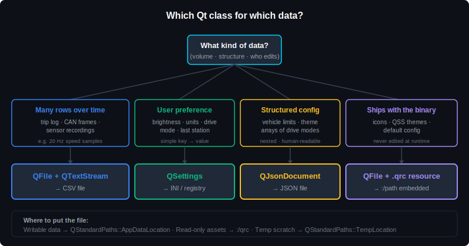

# Module 06 — File I/O & Data Logging

> Save trip data, persist user preferences, load vehicle configuration. Four Qt classes handle 90 % of file I/O in an automotive HMI: `QFile`, `QTextStream`, `QSettings`, and `QJsonDocument`.

| Phase | Level | Time | Qt modules |
| --- | --- | --- | --- |
| Phase 2 — Intermediate Qt | Intermediate | 2 hours | Qt Core |

---

## Table of Contents

1. [Why File I/O Matters](#1-why-file-io-matters)
2. [File I/O in Automotive HMIs](#2-file-io-in-automotive-hmis)
3. [Writing a Log File with `QFile` + `QTextStream`](#3-writing-a-log-file-with-qfile--qtextstream)
4. [Reading a File Back](#4-reading-a-file-back)
5. [Persisting Settings with `QSettings`](#5-persisting-settings-with-qsettings)
6. [JSON for Vehicle Configuration](#6-json-for-vehicle-configuration)
7. [Standard Paths — Where to Put Files](#7-standard-paths--where-to-put-files)
8. [Official Documentation Map](#8-official-documentation-map)
9. [Reference Videos](#9-reference-videos)
10. [Common Errors & Fixes](#10-common-errors--fixes)

---

## 1. Why File I/O Matters

An HMI in operation constantly generates and reads data files. A driver finishes a trip — the cluster needs to save distance, average speed, and fuel used. The user changes the cluster from km/h to mph — that preference has to survive the next power cycle. An OEM engineer wants to replay a recorded CAN session for debugging — the file has to stream through the same widgets that drove the live data.

C++ has its own file I/O (`std::ifstream`, `fopen`), but Qt's `QFile` / `QTextStream` layer is more convenient for HMI work: it handles text encoding, plays nicely with `QString`, integrates with the event loop, and runs identically on Linux / Windows / QNX — the three platforms where automotive Qt code typically ends up.

This module covers the four classes that handle almost every file-I/O need in a real cluster, in the order you'll meet them.

---

## 2. File I/O in Automotive HMIs

The common use cases and the right tool for each:

| Use case | Class | Format |
| --- | --- | --- |
| Trip log (speed/RPM over time) | `QFile` + `QTextStream` | CSV |
| Diagnostic log replay | `QFile` + `QTextStream` | CSV / NMEA |
| User preferences (units, brightness, language) | `QSettings` | INI / registry |
| Vehicle configuration (speed limits, themes) | `QJsonDocument` | JSON |
| Theme files (stylesheets) | `QFile` | text |
| Service history records | `QSettings` or JSON | INI / JSON |
| Temporary scratch data (cached map tiles) | `QFile` | binary |

Notice the pattern: large or streaming text → `QFile` + `QTextStream`; small key/value preferences → `QSettings`; structured configuration → `QJsonDocument`. Don't mix them up — `QSettings` for a 10-MB trip log is wrong, and CSV for "remember the brightness" is overkill.

  

---

## 3. Writing a Log File with `QFile` + `QTextStream`

The classic trip logger — append a timestamp, speed, and RPM line every second.

    void TripLogger::logSample(int kmh, int rpm) {
        QFile file("trip.csv");
        if (!file.open(QIODevice::Append | QIODevice::Text)) {
            qWarning() << "Cannot open log file:" << file.errorString();
            return;
        }

        QTextStream out(&file);
        out << QDateTime::currentDateTime().toString(Qt::ISODate)
            << "," << kmh
            << "," << rpm << "\n";
        // QFile closes automatically when 'file' goes out of scope
    }

### The four `open()` flags worth knowing

| Flag | Meaning |
| --- | --- |
| `QIODevice::WriteOnly` | Overwrite the file from scratch |
| `QIODevice::Append` | Add to the end of an existing file |
| `QIODevice::Text` | Convert line endings to the OS native (CRLF on Windows, LF on Linux) |
| `QIODevice::Truncate` | Empty the file before writing |

You can OR them together: `QIODevice::WriteOnly | QIODevice::Text | QIODevice::Truncate`.

### Performance note for high-rate logging

If you're logging 20–50 CAN frames per second, **don't open and close the file every sample.** Keep one `QFile` member alive across calls and only close it when you stop logging. Opening is the expensive part — writing is cheap.

> 📘 **Reference:** [QFile (Qt 6.1)](https://doc.qt.io/archives/qt-6.1/qfile.html) · [QTextStream (Qt 6.1)](https://doc.qt.io/archives/qt-6.1/qtextstream.html) · [QIODevice::OpenMode (Qt 6.1)](https://doc.qt.io/archives/qt-6.1/qiodevice.html#OpenMode-enum)

---

## 4. Reading a File Back

To replay a recorded trip log line by line, emitting each sample as a signal so the rest of the HMI sees it just like live data:

    void TripReplay::loadFile(const QString &path) {
        QFile file(path);
        if (!file.open(QIODevice::ReadOnly | QIODevice::Text)) {
            qWarning() << "Cannot open file:" << file.errorString();
            return;
        }

        QTextStream in(&file);
        while (!in.atEnd()) {
            const QString line = in.readLine();
            const QStringList parts = line.split(',');
            if (parts.size() != 3) continue;            // skip malformed lines

            const QString timestamp = parts[0];
            const int kmh = parts[1].toInt();
            const int rpm = parts[2].toInt();
            emit sampleLoaded(timestamp, kmh, rpm);
        }
    }

Two reading strategies:

- **`readLine()` in a loop** — for log files of any size. Streams one line at a time, keeps memory low. Use this for trip logs.
- **`readAll()`** — returns the whole file as a `QByteArray` or `QString`. Convenient for small config files (under 100 KB). Don't use it for trip logs.

---

## 5. Persisting Settings with `QSettings`

"Remember the user's preference across reboots" — drive mode, brightness, units, language. You don't want JSON or CSV for this. You want **`QSettings`**: a key/value store where Qt decides the file location, format, and encoding for you.

    // Save
    QSettings settings("MyCarCo", "Cluster");
    settings.setValue("display/units", "km/h");
    settings.setValue("display/brightness", 80);
    settings.setValue("drive/mode", "Sport");

    // Load (somewhere else, possibly after a reboot)
    QSettings settings("MyCarCo", "Cluster");
    const QString units      = settings.value("display/units", "km/h").toString();
    const int    brightness  = settings.value("display/brightness", 50).toInt();
    const QString driveMode  = settings.value("drive/mode", "Comfort").toString();

The `(organization, application)` constructor decides where the settings file actually lives:

- **Linux** — `~/.config/MyCarCo/Cluster.conf`
- **Windows** — registry under `HKCU\Software\MyCarCo\Cluster`
- **QNX / embedded** — configurable via `QSettings::setPath`

The second argument to `value()` is the default returned if the key doesn't exist yet — saves you from writing existence checks.

### When to use `QSettings`

| Good fit | Bad fit |
| --- | --- |
| User preferences (units, brightness) | Trip logs (use QFile) |
| Last-known state (radio station, AC temp) | Vehicle config that ships with the binary (use JSON) |
| Service intervals, mileage at last service | Large structured data (use JSON or SQLite) |

> 📘 **Reference:** [QSettings (Qt 6.1)](https://doc.qt.io/archives/qt-6.1/qsettings.html)

---

## 6. JSON for Vehicle Configuration

Vehicle configuration files — speed limits, warning thresholds, theme color palettes, available drive modes — are usually JSON. They ship with the application binary, get parsed at startup, and rarely change at runtime.

Qt parses JSON with **`QJsonDocument`** + **`QJsonObject`** + **`QJsonArray`**.

### Reading

    void Config::load(const QString &path) {
        QFile file(path);
        if (!file.open(QIODevice::ReadOnly)) return;

        const QByteArray raw = file.readAll();
        QJsonParseError err;
        QJsonDocument doc = QJsonDocument::fromJson(raw, &err);
        if (err.error != QJsonParseError::NoError) {
            qWarning() << "JSON parse error:" << err.errorString();
            return;
        }

        const QJsonObject root = doc.object();
        m_maxSpeed   = root["maxSpeed"].toInt();
        m_themeColor = root["themeColor"].toString();

        // Read an array
        const QJsonArray modes = root["driveModes"].toArray();
        for (const QJsonValue &v : modes) {
            m_driveModes.append(v.toString());
        }
    }

### Writing

    QJsonObject root;
    root["maxSpeed"] = 240;
    root["themeColor"] = "#00d4ff";

    QJsonArray modes;
    modes.append("Eco");
    modes.append("Comfort");
    modes.append("Sport");
    root["driveModes"] = modes;

    QFile file("config.json");
    file.open(QIODevice::WriteOnly | QIODevice::Text);
    file.write(QJsonDocument(root).toJson(QJsonDocument::Indented));

`QJsonDocument::Indented` produces human-readable output for files you'll edit by hand; `QJsonDocument::Compact` saves bytes for production.

> 📘 **Reference:** [QJsonDocument (Qt 6.1)](https://doc.qt.io/archives/qt-6.1/qjsondocument.html) · [QJsonObject (Qt 6.1)](https://doc.qt.io/archives/qt-6.1/qjsonobject.html) · [QJsonArray (Qt 6.1)](https://doc.qt.io/archives/qt-6.1/qjsonarray.html)

---

## 7. Standard Paths — Where to Put Files

Hard-coding `"trip.csv"` writes to the current working directory, which is unpredictable on embedded systems (could be `/`, could be `/home/qt`, depends on how the launcher invoked your binary). Use **`QStandardPaths`** to get the right OS-specific location every time.

    const QString dir = QStandardPaths::writableLocation(QStandardPaths::AppDataLocation);
    QDir().mkpath(dir);                            // ensure folder exists
    const QString logPath = dir + "/trip.csv";

### The locations you'll use

| Location | Use for |
| --- | --- |
| `AppDataLocation` | Settings, user data per app — the default choice |
| `AppLocalDataLocation` | Non-roaming data on Windows (same as AppData on Linux) |
| `DocumentsLocation` | User-visible documents (rarely needed for clusters) |
| `TempLocation` | Temporary scratch files — wiped by the OS |
| `CacheLocation` | Re-downloadable cached data (map tiles, thumbnails) |

For shipped read-only assets (icons, default themes, the JSON config that comes with the binary) — use the Qt **resource system** with `:/` paths instead. That keeps them embedded in the executable. Resource files are covered in their own dedicated module.

> 📘 **Reference:** [QStandardPaths (Qt 6.1)](https://doc.qt.io/archives/qt-6.1/qstandardpaths.html) · [QDir (Qt 6.1)](https://doc.qt.io/archives/qt-6.1/qdir.html)

---

## 8. Official Documentation Map

Every link is the **Qt 6.1** version (same pages exist under `doc.qt.io/qt-5/...` for Qt 5.15).

| Resource | What it gives you |
| --- | --- |
| [QFile](https://doc.qt.io/archives/qt-6.1/qfile.html) | Core file operations — open, read, write, close |
| [QTextStream](https://doc.qt.io/archives/qt-6.1/qtextstream.html) | Stream-style text reading/writing with encoding handling |
| [QIODevice](https://doc.qt.io/archives/qt-6.1/qiodevice.html) | Base for QFile — `open` flags and read/write primitives |
| [QSettings](https://doc.qt.io/archives/qt-6.1/qsettings.html) | Key/value preferences storage |
| [QJsonDocument](https://doc.qt.io/archives/qt-6.1/qjsondocument.html) | JSON parsing and serialization |
| [QJsonObject](https://doc.qt.io/archives/qt-6.1/qjsonobject.html) · [QJsonArray](https://doc.qt.io/archives/qt-6.1/qjsonarray.html) | JSON object and array handling |
| [QStandardPaths](https://doc.qt.io/archives/qt-6.1/qstandardpaths.html) | OS-specific writable locations |
| [QDir](https://doc.qt.io/archives/qt-6.1/qdir.html) | Directory operations, path manipulation |

---

## 9. Reference Videos

| Video | Length | Why watch |
| --- | --- | --- |
| [Qt File I/O Tutorial — QFile & QTextStream](https://www.youtube.com/watch?v=53GIvi4FjAY) | ~15 min | First read/write, the open flags |
| [QSettings — Saving User Preferences in Qt](https://www.youtube.com/watch?v=NS5gIeFCmZc) | ~12 min | Practical walkthrough with widgets |
| [JSON in Qt C++ — Read and Write](https://www.youtube.com/watch?v=YOoQfvAQ1Sk) | ~18 min | QJsonDocument + QJsonObject |
| [QStandardPaths Explained](https://www.youtube.com/watch?v=h_VqVx7iXMA) | ~10 min | Cross-platform path handling |

---

## 10. Common Errors & Fixes

The things that bite every Qt newcomer when working with files.

### `QFile::open` returns false silently

You forgot to check the return value, then wrote to a file that was never opened — nothing happened, no warning. **Fix:** always `if (!file.open(...)) { qWarning() << file.errorString(); return; }`. `errorString()` tells you exactly why (permission, missing path, file locked).

### File written but empty when I open it

`QTextStream` buffers writes. If your program crashes or you read the file while the writer is still alive, the buffer hasn't been flushed yet. **Fix:** let the `QFile` destructor close the file (it flushes on close), or call `out.flush()` explicitly before reading.

### CSV log file is fine on Linux, has blank lines on Windows

You used `"\n"` without the `QIODevice::Text` flag. On Windows, Notepad expects `\r\n`. **Fix:** open with `QIODevice::WriteOnly | QIODevice::Text`. The `Text` flag translates `\n` to the platform-correct line ending automatically.

### `QSettings` writes but next launch sees old values

You created the `QSettings` object with a different organization or application name. The settings landed in a different file/registry key. **Fix:** use the same `("organization", "application")` pair everywhere — usually wrapped in a helper function so you can't typo it.

### JSON parses but my values are zero or empty strings

Your key names don't match exactly. JSON is case-sensitive, and `root["maxspeed"].toInt()` returns 0 if the actual key is `"maxSpeed"`. **Fix:** print the parsed JSON during development to confirm the keys, or use `root.contains("maxSpeed")` to check before reading.

### `QJsonDocument::fromJson` returns an empty doc

Invalid JSON. Always pass a `QJsonParseError` and check it:

    QJsonParseError err;
    QJsonDocument doc = QJsonDocument::fromJson(raw, &err);
    if (err.error != QJsonParseError::NoError) {
        qWarning() << "JSON parse error at offset" << err.offset << ":" << err.errorString();
    }

The offset tells you exactly which byte the parser choked on — invaluable for tracking down a missing comma or quote.

### File works during development, missing in production build

You hard-coded a path relative to your build directory. After deployment that path doesn't exist. **Fix:** use `QStandardPaths::writableLocation` for writable files, or `:/path` resource paths for read-only assets that ship with the binary.

### "Permission denied" writing to a system path

On Linux/QNX you can't write to `/etc` or `/var/lib` unless you're root. On Windows `Program Files` is similarly restricted. **Fix:** always write to `AppDataLocation` or `AppLocalDataLocation` — those are the OS-blessed user-writable spots.

### `QSettings` corrupted after power loss

The cluster lost power mid-write. **Fix for safety-critical settings:** write a temporary file, fsync, then atomically rename over the real settings file. For typical user preferences, the occasional reset is acceptable — accept the loss and reset to defaults.

### Build error: `'QSettings' was not declared in this scope`

Missing include. Add `#include <QSettings>` (or `<QFile>`, `<QJsonDocument>`, etc.). Each class is its own header in Qt 6.

### Reading a UTF-8 file produces garbled characters

`QTextStream` defaults to UTF-8 in Qt 6, so this is rare — but in mixed-platform projects, force it explicitly:

    QTextStream in(&file);
    in.setEncoding(QStringConverter::Utf8);

---

## What's next

You can now read and write the data your HMI runs on. Next, you'll learn to make it *look* like an automotive cluster — dark backgrounds, brand colors, hover/pressed button states — using **[Module 07 — Qt StyleSheets (QSS)](https://github.com/ManeParag/Qt_Automotive_Training/blob/main/07-Qt-StyleSheets-QSS)** *(coming soon)*.

A worked sample project — a trip logger that records speed/RPM and replays from a CSV — will live in a subfolder next to this README.

---

← [Previous module](https://github.com/ManeParag/Qt_Automotive_Training/blob/main/05-QTimer-QThread-Real-time-Updates) · [Back to syllabus](https://github.com/ManeParag/Qt_Automotive_Training/blob/main/README.md) · [Next module →](https://github.com/ManeParag/Qt_Automotive_Training/blob/main/07-Qt-StyleSheets-QSS) *(coming soon)*
