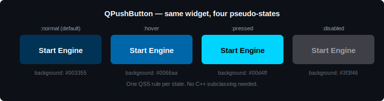
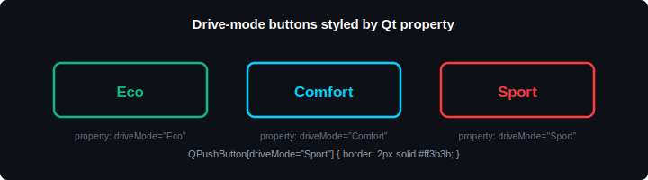

# Module 07 — Qt StyleSheets (QSS)

> Take the default grey Qt look to a polished automotive cluster aesthetic. Qt StyleSheets are CSS-style rules — colors, fonts, borders, hover/pressed states — applied to every standard widget without touching `paintEvent`.

| Phase | Level | Time | Qt modules |
| --- | --- | --- | --- |
| Phase 2 — Intermediate Qt | Intermediate | 2 hours | Qt Widgets |

---

## Table of Contents

1. [Why QSS Matters](#1-why-qss-matters)
2. [QSS in Automotive HMIs](#2-qss-in-automotive-hmis)
3. [The Mechanism — Setting a StyleSheet](#3-the-mechanism--setting-a-stylesheet)
4. [Selectors and Properties](#4-selectors-and-properties)
5. [Pseudo-states — `:hover`, `:pressed`, `:disabled`](#5-pseudo-states--hover-pressed-disabled)
6. [Object Names and Dynamic Properties](#6-object-names-and-dynamic-properties)
7. [Loading a QSS from a File](#7-loading-a-qss-from-a-file)
8. [The Limits of QSS — Custom-Painted Widgets](#8-the-limits-of-qss--custom-painted-widgets)
9. [Official Documentation Map](#9-official-documentation-map)
10. [Reference Videos](#10-reference-videos)
11. [Common Errors & Fixes](#11-common-errors--fixes)

---

## 1. Why QSS Matters

Out of the box, a Qt Widgets application looks like a generic desktop form — default grey backgrounds, default fonts, default chunky buttons. For an automotive cluster, that's nowhere near good enough. Drivers expect dark backgrounds with high contrast, OEM brand colors, generous touch targets, and color-coded warnings (red urgent, amber caution, green OK).

You could subclass every widget and override its paint event to get this look. That works but explodes into thousands of lines of code. **Qt StyleSheets (QSS)** is the better answer for stock widgets: you write a single CSS-like text file that says *"every QPushButton has a dark background, white text, a glow on hover, and switches to brand blue when pressed"*, and Qt applies it to every matching widget automatically.

If you've used CSS for web pages, QSS will feel familiar — the syntax is nearly identical, with a smaller vocabulary limited to what Qt widgets actually expose.

One important caveat up front: **QSS styles standard Qt widgets only.** The custom-painted speedometer from Module 04 doesn't read stylesheet rules — it paints whatever you tell it to. Section 8 explains how to handle that boundary.

---

## 2. QSS in Automotive HMIs

What QSS gets used for in a real cluster:

| HMI element | What QSS controls |
| --- | --- |
| Cluster background | Dark gradient or solid black |
| Drive-mode buttons | Color per mode (green Eco, blue Comfort, red Sport) |
| Touch buttons | Large padding, rounded corners, hover/pressed states |
| Warning labels | Red text on yellow background for critical alerts |
| Sliders (volume, brightness) | Brand-colored groove and handle |
| Settings menu items | Hover highlight, selected-row indicator |
| Status labels | Color-coded (green/amber/red) by `setProperty` |
| Disabled controls | Greyed out, reduced opacity |

Notice the pattern: anything that's a stock widget gets styled with QSS. Anything that's a custom-painted gauge or graphic gets painted in code (Module 04). The two complement each other.

---

## 3. The Mechanism — Setting a StyleSheet

A stylesheet is just a string of CSS-like text. You can apply it in three scopes:

### On a single widget

    button->setStyleSheet("background-color: #00d4ff; color: white;");

This affects only that one widget.

### On a parent widget (cascades to children)

    mainWindow->setStyleSheet(
        "QPushButton { background-color: #333; color: white; }"
    );

Every `QPushButton` *inside* `mainWindow` now uses that style — children inherit from parents.

### App-wide (the usual choice for HMIs)

    qApp->setStyleSheet(globalQssText);

This applies to every widget in the app. For automotive clusters this is what you want — your whole UI shares one consistent look defined in one place.

> 📘 **Reference:** [Qt Style Sheets (Qt 6.1)](https://doc.qt.io/archives/qt-6.1/stylesheet.html) · [QWidget::setStyleSheet](https://doc.qt.io/archives/qt-6.1/qwidget.html#styleSheet-prop)

---

## 4. Selectors and Properties

A QSS rule has two parts: a **selector** (which widgets to style) and a **declaration block** (what to set).

    /* selector */    /* declaration block */
    QPushButton    {  background-color: #00d4ff;
                      color: white;
                      border-radius: 6px;  }

### The selectors you'll actually use

| Selector | Matches | Example |
| --- | --- | --- |
| `QPushButton` | every `QPushButton` and its subclasses | `QPushButton { color: white; }` |
| `.QPushButton` | only exactly `QPushButton`, not subclasses | `.QPushButton { ... }` |
| `#startButton` | the widget whose `objectName` is `startButton` | `#startButton { ... }` |
| `QPushButton[mode="Sport"]` | by Qt property | `QPushButton[mode="Sport"] { ... }` |
| `QWidget > QPushButton` | direct children only | `QWidget > QPushButton { ... }` |

### The properties you'll use 90 % of the time

    QPushButton {
        background-color: #003355;
        color: white;
        border: 2px solid #00d4ff;
        border-radius: 8px;
        padding: 10px 20px;
        font-size: 16px;
        font-weight: bold;
        min-width: 120px;
    }

Colors accept hex (`#00d4ff`), rgb (`rgb(0, 212, 255)`), rgba with alpha (`rgba(0, 212, 255, 200)`), or named (`white`, `red`). Use hex for HMI work — designers hand it to you that way.

> 📘 **Reference:** [QSS Reference — list of properties (Qt 6.1)](https://doc.qt.io/archives/qt-6.1/stylesheet-reference.html) · [QSS Syntax (Qt 6.1)](https://doc.qt.io/archives/qt-6.1/stylesheet-syntax.html)

---

## 5. Pseudo-states — `:hover`, `:pressed`, `:disabled`

A button doesn't look the same in every state. QSS pseudo-states let you style each one without writing any C++.

  

    QPushButton {
        background-color: #003355;
        color: white;
        border-radius: 6px;
        padding: 10px 20px;
    }

    QPushButton:hover {
        background-color: #0066aa;
    }

    QPushButton:pressed {
        background-color: #00d4ff;
        color: black;
    }

    QPushButton:disabled {
        background-color: #555;
        color: #999;
    }

### Pseudo-states worth knowing

| Pseudo-state | When it applies |
| --- | --- |
| `:hover` | Pointer/touch over the widget |
| `:pressed` | Button currently held down |
| `:disabled` | Widget has `setEnabled(false)` |
| `:checked` | Toggle button or checkbox is on |
| `:focus` | Widget has keyboard focus |

You can chain them: `QPushButton:hover:pressed { ... }`.

For an HMI, the most visible ones are `:pressed` (gives instant tactile feedback on touch) and `:disabled` (signals to the driver that a control isn't available right now).

---

## 6. Object Names and Dynamic Properties

When you need to style *one specific widget* differently from others of the same type — say the big red "Start Engine" button — give it an object name in C++ and target it in QSS.

    // C++
    startButton->setObjectName("startButton");

    /* QSS */
    QPushButton#startButton {
        background-color: #cc0000;
        font-size: 24px;
        min-width: 240px;
    }

### Dynamic property selectors — for live state-driven styling

Instead of hard-coding "Sport mode buttons are red," let the button advertise its mode as a Qt property and let QSS react. This is how a drive-mode panel changes color when the user switches mode.

    // C++ — set a custom property
    button->setProperty("driveMode", "Sport");

    // QSS — style by property value
    QPushButton[driveMode="Eco"]     { border: 2px solid #00ff88; }
    QPushButton[driveMode="Comfort"] { border: 2px solid #00aaff; }
    QPushButton[driveMode="Sport"]   { border: 2px solid #ff3333; }

  

When you change the property at runtime, Qt doesn't automatically re-style — you have to ask it to:

    button->setProperty("driveMode", "Sport");
    button->style()->unpolish(button);
    button->style()->polish(button);

That two-line dance forces a re-evaluation of all selectors. Wrap it in a helper if you do it often.

> 📘 **Reference:** [Customizing Qt Widgets Using Style Sheets (Qt 6.1)](https://doc.qt.io/archives/qt-6.1/stylesheet-customizing.html)

---

## 7. Loading a QSS from a File

For anything bigger than 20 lines, don't put QSS as a string in C++. Put it in a `.qss` file, ship it as a resource, load it at startup.

    QFile file(":/styles/cluster.qss");
    if (file.open(QIODevice::ReadOnly | QIODevice::Text)) {
        qApp->setStyleSheet(file.readAll());
    }

The `:/styles/cluster.qss` path is a Qt **resource path** — the file is embedded in your binary at build time via a `.qrc` file, so there's no separate file to deploy and no risk of it being missing.

This is also how you support **multiple themes** (day/night cluster, OEM-branded skins): keep `day.qss` and `night.qss` in resources, load the right one based on a `QSettings` value, and reload `qApp->setStyleSheet(...)` when the driver toggles. The whole UI re-styles instantly.

Resource files are covered in their own module — for now, just know that `:/...` paths read from inside the binary.

---

## 8. The Limits of QSS — Custom-Painted Widgets

QSS only styles standard Qt widgets. The speedometer you built in Module 04 — the one with `QPainter` calls inside `paintEvent` — **does not read QSS rules.** It paints whatever your code tells it to, ignoring any stylesheet you set.

This is by design. `QPainter` is faster and more precise than stylesheet rendering, which is exactly why you used it for gauges and needles. The trade-off is that you lose automatic theming.

Two ways to keep custom widgets visually consistent with the rest of the QSS-styled HMI:

### Option 1 — define colors as constants and reuse

    namespace Theme {
        inline const QColor primary = QColor("#00d4ff");
        inline const QColor warning = QColor("#ff3333");
        inline const QColor background = QColor("#0a0a0a");
    }

Use the same constants in both your QSS string (built at runtime) and your `paintEvent` calls. One source of truth.

### Option 2 — let custom widgets respect basic stylesheet background

For `QWidget` subclasses that override `paintEvent` but want to honor at least the `background-color` set in QSS, paint the stylesheet background manually at the start of your paint event:

    void Speedometer::paintEvent(QPaintEvent *) {
        QStyleOption opt;
        opt.initFrom(this);
        QPainter p(this);
        style()->drawPrimitive(QStyle::PE_Widget, &opt, &p, this);

        // ... now your custom drawing on top
    }

The first three lines respect any stylesheet background; the rest of your paint code does the custom gauge drawing.

For complete styling consistency, Option 1 is what most production HMIs do.

---

## 9. Official Documentation Map

Every link is the **Qt 6.1** version (same pages exist under `doc.qt.io/qt-5/...` for Qt 5.15).

### Core references

| Resource | What it gives you |
| --- | --- |
| [Qt Style Sheets Overview](https://doc.qt.io/archives/qt-6.1/stylesheet.html) | Master entry point — read first |
| [QSS Syntax](https://doc.qt.io/archives/qt-6.1/stylesheet-syntax.html) | Selectors, declarations, comments |
| [QSS Reference](https://doc.qt.io/archives/qt-6.1/stylesheet-reference.html) | Every supported property, per widget |
| [QSS Examples](https://doc.qt.io/archives/qt-6.1/stylesheet-examples.html) | Working examples for each widget type |

### Customizing specific widgets

| Resource | What it gives you |
| --- | --- |
| [Customizing Qt Widgets](https://doc.qt.io/archives/qt-6.1/stylesheet-customizing.html) | Buttons, sliders, checkboxes, etc. |
| [QSS Designer](https://doc.qt.io/archives/qt-6.1/stylesheet-designer.html) | Editing stylesheets in Qt Creator |
| [Subcontrols Reference](https://doc.qt.io/archives/qt-6.1/stylesheet-reference.html#list-of-sub-controls) | Styling parts of complex widgets (slider handle, scrollbar arrows) |

---

## 10. Reference Videos

| Video | Length | Why watch |
| --- | --- | --- |
| [Qt StyleSheets — The Basics](https://www.youtube.com/watch?v=I-_KZ7Z9F4M) | ~15 min | First stylesheet, syntax, selectors |
| [Styling Buttons and Widgets with QSS](https://www.youtube.com/watch?v=ZmoR-WS_t8s) | ~20 min | Button states, hover, pressed |
| [Dark Theme in Qt — Step by Step](https://www.youtube.com/watch?v=5xPM7p6BTtA) | ~18 min | Building a complete dark-themed app |
| [Qt StyleSheets — Dynamic Properties](https://www.youtube.com/watch?v=hbV58TbcvN0) | ~12 min | Property selectors and runtime restyling |
| [QSS for Automotive UI Look](https://www.youtube.com/watch?v=NJ5tt6PQzdo) | ~22 min | Cluster-style theming examples |

---

## 11. Common Errors & Fixes

The things that bite every Qt newcomer when working with stylesheets.

### My stylesheet has no effect

Walk down this checklist:

1. Did you actually call `setStyleSheet(...)`? An unset stylesheet does nothing.
2. Does your selector match anything? Try with just `QPushButton { background-color: red; }` first — if even that doesn't work, the stylesheet isn't being loaded.
3. Is the widget a custom-painted subclass that overrides `paintEvent`? QSS doesn't apply (see §8).
4. Did you mistype a property name? QSS silently ignores unknown properties — `colur: white;` produces no error.
5. Is a more specific selector elsewhere overriding yours? Object name (`#startButton`) wins over type (`QPushButton`).

### Custom widget shows wrong background color

Your custom widget overrides `paintEvent` and doesn't paint the stylesheet background. **Fix:** add the `QStyleOption / PE_Widget` snippet from §8 at the top of your `paintEvent`.

### Property selector doesn't react when I change the property

Qt doesn't automatically re-evaluate stylesheets on property changes. **Fix:** after `setProperty`, call:

    widget->style()->unpolish(widget);
    widget->style()->polish(widget);

### One widget styled, but its children aren't

You set the stylesheet on a single widget, not its parent. Stylesheets cascade *downward* from where they're set. **Fix:** set the stylesheet on the parent or on `qApp` for global rules.

### Loading `.qss` from a file returns empty string

Either the path is wrong or the resource isn't compiled in. **Fix:**

- For filesystem paths, check `file.exists()` and `file.errorString()`.
- For resource paths (`:/...`), confirm the `.qrc` file actually lists the `.qss` and that you've rebuilt after changing the resource file.

### Stylesheet on `qApp` triggers a flicker on startup

`qApp->setStyleSheet(...)` after widgets exist forces a full restyle. **Fix:** set it as early as possible, ideally right after creating `QApplication` and before any widget is shown.

### Border-radius doesn't round my widget

Some widgets need an explicit border to show the radius. **Fix:** always pair `border-radius` with a `border` (even `border: 1px solid transparent;` works).

### Hover state works on button but not on the parent container

`:hover` requires the parent to have `setAttribute(Qt::WA_Hover)` set, or be a widget that already tracks hover natively. **Fix:** call `parent->setAttribute(Qt::WA_Hover);` from C++.

### Gradient looks blocky or doesn't appear

You wrote it as a CSS gradient (`linear-gradient(...)`). QSS uses Qt-specific syntax:

    QPushButton {
        background-color: qlineargradient(
            x1:0, y1:0, x2:0, y2:1,
            stop:0 #00d4ff, stop:1 #003355);
    }

Note `qlineargradient`, not `linear-gradient`, and the coordinate system uses `x1, y1, x2, y2` in 0–1 range.

### Build error: `'setStyleSheet' was not declared in this scope`

You're trying to call it on something that isn't a `QWidget`. Stylesheets are a widget feature — non-widget `QObject`s don't support them.

### Specificity confusion — two rules conflict, the "wrong" one wins

QSS specificity goes: object name (`#x`) > class with type (`.QPushButton`) > type (`QPushButton`) > inherited. When in doubt, increase specificity on the rule you want to win — for example use `QMainWindow QPushButton#startButton` instead of just `#startButton`.

---

## What's next

Phase 2 is now complete — you can build live, animated, persistent, well-styled cluster UIs. Phase 3 starts with **[Module 08 — QtCharts](https://github.com/ManeParag/Qt_Automotive_Training/blob/main/08-QtCharts)** *(coming soon)* — built-in line, bar, and area charts for trip stats, fuel history, and diagnostic views.

A worked sample project — a complete dark-themed cluster panel with drive-mode buttons and theme switching — will live in a subfolder next to this README.

---

← [Previous module](https://github.com/ManeParag/Qt_Automotive_Training/blob/main/06-File-IO-Data-Logging) · [Back to syllabus](https://github.com/ManeParag/Qt_Automotive_Training/blob/main/README.md) · [Next module →](https://github.com/ManeParag/Qt_Automotive_Training/blob/main/08-QtCharts) *(coming soon)*
