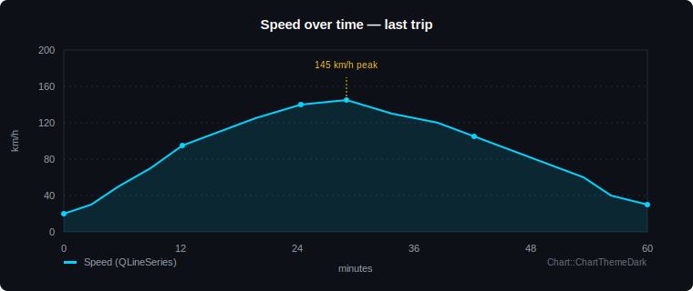

# Module 08 — QtCharts

> Built-in chart widgets for trip statistics and history views. Two series types — line and bar — cover almost every chart you'll need in an automotive HMI cluster.

| Phase | Level | Time | Qt modules |
| --- | --- | --- | --- |
| Phase 3 — Advanced Qt | Intermediate → Advanced | 1.5 hours | Qt Charts · Qt Widgets |

---

## Table of Contents

1. [Why QtCharts Matters](#1-why-qtcharts-matters)
2. [QtCharts in Automotive HMIs](#2-qtcharts-in-automotive-hmis)
3. [Setting Up — Adding QtCharts to a Project](#3-setting-up--adding-qtcharts-to-a-project)
4. [Line Chart — Speed Over Time](#4-line-chart--speed-over-time)
5. [Bar Chart — Weekly Fuel Use](#5-bar-chart--weekly-fuel-use)
6. [Themes, Colors, and Cluster-Friendly Styling](#6-themes-colors-and-cluster-friendly-styling)
7. [Real-time Updates — Appending Live Data](#7-real-time-updates--appending-live-data)
8. [Official Documentation Map](#8-official-documentation-map)
9. [Reference Videos](#9-reference-videos)
10. [Common Errors & Fixes](#10-common-errors--fixes)

---

## 1. Why QtCharts Matters

A cluster shows the *current* state — speed, RPM, fuel — but a good HMI also lets the driver look back. *How was my last trip? Am I using more fuel this month than last?* Those questions need charts.

You could draw charts yourself with `QPainter` (Module 04). But for standard line and bar charts that's a lot of code for something Qt already ships. **QtCharts** is Qt's first-party charting module: data goes in via `QXxxSeries` classes, a `QChart` arranges them with axes and a legend, and a `QChartView` widget displays the result inside any layout.

If Module 04 taught you to paint custom gauges, QtCharts is what you reach for when the data is a *series of values* and you want a chart that looks like a chart — fast, themed, and identical across Linux, Windows, and QNX.

---

## 2. QtCharts in Automotive HMIs

What charts get used for in a real cluster:

| Use case | Chart type | Series class |
| --- | --- | --- |
| Speed history over current trip | Line | `QLineSeries` / `QSplineSeries` |
| Fuel consumption per week | Bar | `QBarSeries` |
| Average fuel economy trend (12 months) | Spline | `QSplineSeries` |
| Tyre-pressure readings per wheel | Bar (grouped) | `QBarSeries` with 4 sets |
| Battery state-of-charge through the day | Line | `QLineSeries` |
| Distance per drive mode (Eco / Comfort / Sport) | Bar | `QBarSeries` |
| Service-cost trend over months | Line | `QLineSeries` |
| Trip duration vs. distance (last 10 trips) | Bar | `QBarSeries` |

Pattern: anything that's a **sequence of (x, y) pairs over time** is a line; anything that's **a value per named category** is a bar. Between the two you've covered the practical needs of an automotive history screen.

A sample line chart looks like this in a real cluster trip-stats screen:

  

---

## 3. Setting Up — Adding QtCharts to a Project

QtCharts is a separate Qt module — not part of Qt Core or Qt Widgets. Two steps before you can use it:

### Add it to the build

**qmake (.pro file):**

    QT += charts

**CMake (CMakeLists.txt):**

    find_package(Qt6 REQUIRED COMPONENTS Charts)
    target_link_libraries(my_app PRIVATE Qt6::Charts)

### Bring it into scope

In any source file that uses charts:

    #include <QtCharts>

You can also include the specific class headers (`<QLineSeries>`, `<QChart>`, `<QChartView>`) for faster compiles.

> 📘 **Reference:** [Qt Charts Overview (Qt 6.1)](https://doc.qt.io/archives/qt-6.1/qtcharts-overview.html) · [Getting Started with Qt Charts](https://doc.qt.io/archives/qt-6.1/qtcharts-index.html)

---

## 4. Line Chart — Speed Over Time

The classic trip-history chart. X-axis is time, Y-axis is speed.

    // Create the series and add data points
    auto *series = new QLineSeries();
    series->setName("Speed (km/h)");
    series->append(0,   0);
    series->append(2,  35);
    series->append(5,  80);
    series->append(12, 110);
    series->append(20, 95);
    series->append(35, 60);
    series->append(45, 0);

    // Create the chart and attach the series
    auto *chart = new QChart();
    chart->addSeries(series);
    chart->setTitle("Speed over the last trip");
    chart->createDefaultAxes();          // generates X and Y axes that fit the data

    // Wrap it in a widget you can drop into a layout
    auto *chartView = new QChartView(chart);
    chartView->setRenderHint(QPainter::Antialiasing);
    layout->addWidget(chartView);

### Customising the axes

`createDefaultAxes()` is convenient for prototyping but you usually want explicit control:

    auto *axisX = new QValueAxis();
    axisX->setRange(0, 60);
    axisX->setTitleText("Minutes");
    chart->addAxis(axisX, Qt::AlignBottom);
    series->attachAxis(axisX);

    auto *axisY = new QValueAxis();
    axisY->setRange(0, 200);
    axisY->setTitleText("km/h");
    axisY->setTickCount(6);              // 0, 40, 80, 120, 160, 200
    chart->addAxis(axisY, Qt::AlignLeft);
    series->attachAxis(axisY);

For smooth curved lines instead of polylines, swap `QLineSeries` for **`QSplineSeries`** — same API, smoother visuals.

> 📘 **Reference:** [QLineSeries (Qt 6.1)](https://doc.qt.io/archives/qt-6.1/qlineseries.html) · [QSplineSeries (Qt 6.1)](https://doc.qt.io/archives/qt-6.1/qsplineseries.html) · [QValueAxis (Qt 6.1)](https://doc.qt.io/archives/qt-6.1/qvalueaxis.html)

---

## 5. Bar Chart — Weekly Fuel Use

Useful for any "value per category" data: fuel per day, mileage per month, service costs per quarter.

    // Each QBarSet is one bar group (one "data series")
    auto *fuel = new QBarSet("Fuel use (L)");
    *fuel << 9.2 << 10.1 << 7.8 << 11.4 << 9.6 << 6.5 << 8.3;

    auto *series = new QBarSeries();
    series->append(fuel);

    auto *chart = new QChart();
    chart->addSeries(series);
    chart->setTitle("Daily fuel use — this week");

    // X-axis as named categories rather than numbers
    QStringList days = {"Mon", "Tue", "Wed", "Thu", "Fri", "Sat", "Sun"};
    auto *axisX = new QBarCategoryAxis();
    axisX->append(days);
    chart->addAxis(axisX, Qt::AlignBottom);
    series->attachAxis(axisX);

    auto *axisY = new QValueAxis();
    axisY->setRange(0, 15);
    axisY->setTitleText("Litres");
    chart->addAxis(axisY, Qt::AlignLeft);
    series->attachAxis(axisY);

    auto *chartView = new QChartView(chart);
    chartView->setRenderHint(QPainter::Antialiasing);

For grouped bars (e.g. front-left / front-right / rear-left / rear-right tyre pressure across multiple measurement points), append multiple `QBarSet` objects to the same series.

> 📘 **Reference:** [QBarSeries (Qt 6.1)](https://doc.qt.io/archives/qt-6.1/qbarseries.html) · [QBarSet (Qt 6.1)](https://doc.qt.io/archives/qt-6.1/qbarset.html) · [QBarCategoryAxis (Qt 6.1)](https://doc.qt.io/archives/qt-6.1/qbarcategoryaxis.html)

---

## 6. Themes, Colors, and Cluster-Friendly Styling

Default QtCharts looks like a desktop spreadsheet — bright white background, blue accents. Wrong for a dark cluster. Two ways to fix it.

### Built-in themes

QtCharts ships several pre-made themes. For a cluster, pick `ChartThemeDark` or `ChartThemeBlueCerulean`:

    chart->setTheme(QChart::ChartThemeDark);

Available themes: `ChartThemeLight`, `ChartThemeBlueCerulean`, `ChartThemeDark`, `ChartThemeBrownSand`, `ChartThemeBlueNcs`, `ChartThemeHighContrast`, `ChartThemeBlueIcy`, `ChartThemeQt`.

### Manual overrides for OEM colors

Themes give you 90 % of the look. The rest you set explicitly:

    chart->setBackgroundBrush(QBrush(QColor("#0d1117")));
    chart->setTitleBrush(QBrush(Qt::white));
    chart->setPlotAreaBackgroundBrush(QBrush(QColor("#111827")));
    chart->setPlotAreaBackgroundVisible(true);
    chart->legend()->setLabelColor(Qt::white);

    // Per-series color
    QPen pen(QColor("#00d4ff"));
    pen.setWidth(2);
    series->setPen(pen);

    // Axis label colors
    axisX->setLabelsColor(Qt::white);
    axisY->setLabelsColor(Qt::white);
    axisX->setGridLineColor(QColor("#1f2937"));
    axisY->setGridLineColor(QColor("#1f2937"));

For maximum control, you can also style `QChartView` with QSS (Module 07) — but axis/series colors must be set via the QtCharts API as shown above.

---

## 7. Real-time Updates — Appending Live Data

Charts get useful in clusters when they update *as the driver drives*. Hook a `QTimer` (Module 05) or sensor signal up to an `append()` call on the series.

    void Dashboard::onSpeedSampled(int kmh) {
        static int elapsed = 0;
        m_speedSeries->append(elapsed++, kmh);

        // Keep only the last 60 samples — a rolling window
        if (m_speedSeries->count() > 60) {
            m_speedSeries->remove(0);
        }

        // Slide the X-axis along
        m_axisX->setRange(qMax(0, elapsed - 60), elapsed);
    }

The chart re-renders automatically — no need to call `update()` on the view.

### Performance note

For very high-rate updates (100+ samples per second), batch them: collect points into a `QVector<QPointF>` and use `replace()` rather than `append()` once per frame. `append()` triggers a render each call.

    void Dashboard::flushBatchedSamples() {
        m_speedSeries->replace(m_pendingPoints);   // single render
        m_pendingPoints.clear();
    }

A `QTimer` firing at 30 Hz with `replace()` keeps the GUI thread smooth even with 1 kHz incoming data.

---

## 8. Official Documentation Map

Every link is the **Qt 6.1** version (same pages exist under `doc.qt.io/qt-5/...` for Qt 5.15).

### Core classes

| Resource | What it gives you |
| --- | --- |
| [Qt Charts Overview](https://doc.qt.io/archives/qt-6.1/qtcharts-overview.html) | Master entry point |
| [QChart](https://doc.qt.io/archives/qt-6.1/qchart.html) | Container for series, axes, legend, title |
| [QChartView](https://doc.qt.io/archives/qt-6.1/qchartview.html) | Widget that displays a chart in a layout |
| [QAbstractSeries](https://doc.qt.io/archives/qt-6.1/qabstractseries.html) | Base for all series types |

### Series and axes

| Resource | What it gives you |
| --- | --- |
| [QLineSeries](https://doc.qt.io/archives/qt-6.1/qlineseries.html) · [QSplineSeries](https://doc.qt.io/archives/qt-6.1/qsplineseries.html) | Line and curved-line series |
| [QBarSeries](https://doc.qt.io/archives/qt-6.1/qbarseries.html) · [QBarSet](https://doc.qt.io/archives/qt-6.1/qbarset.html) | Bar series and one-bar data sets |
| [QValueAxis](https://doc.qt.io/archives/qt-6.1/qvalueaxis.html) · [QBarCategoryAxis](https://doc.qt.io/archives/qt-6.1/qbarcategoryaxis.html) | Numeric and category axes |
| [QDateTimeAxis](https://doc.qt.io/archives/qt-6.1/qdatetimeaxis.html) | Time-based X-axis |

### Worked examples

| Resource | What it gives you |
| --- | --- |
| [Line Chart Example](https://doc.qt.io/archives/qt-6.1/qtcharts-linechart-example.html) | Step-by-step line chart |
| [Bar Chart Example](https://doc.qt.io/archives/qt-6.1/qtcharts-barchart-example.html) | Step-by-step bar chart |
| [Dynamic Spline Example](https://doc.qt.io/archives/qt-6.1/qtcharts-dynamicspline-example.html) | Real-time appending data |

---

## 9. Reference Videos

| Video | Length | Why watch |
| --- | --- | --- |
| [Qt Charts — Getting Started](https://www.youtube.com/watch?v=BlSEBXY7vh0) | ~15 min | First chart, line and bar |
| [Real-time Line Chart in Qt](https://www.youtube.com/watch?v=ufdSt36LCx0) | ~20 min | Live append with QTimer |
| [Qt Charts Themes Walkthrough](https://www.youtube.com/watch?v=l3DfFhRH7-Y) | ~10 min | Dark theme, custom colours |

---

## 10. Common Errors & Fixes

The things that bite every Qt newcomer when working with QtCharts.

### Linker error: `undefined reference to QtCharts::QChart::QChart()`

You forgot to add the module to the build. **Fix:** `QT += charts` (qmake) or `target_link_libraries(... Qt6::Charts)` (CMake). Then re-run qmake / cmake before rebuilding.

### `QChartView` shows but is empty

The series was created but never added to the chart. **Fix:** `chart->addSeries(series);`. Then make sure axes exist — either `chart->createDefaultAxes()` or explicit `addAxis` + `attachAxis`.

### Axes show but data points are clipped or invisible

Axis range doesn't fit the data. **Fix:** set the range manually with `axis->setRange(min, max)`, or call `chart->createDefaultAxes()` *after* all data is appended (it auto-fits to current data).

### Chart looks pixelated / jagged

You forgot antialiasing. **Fix:** `chartView->setRenderHint(QPainter::Antialiasing);` after constructing the `QChartView`.

### Adding points one by one is slow

Each `append()` triggers a full re-render. **Fix:** for bulk loads, build a `QVector<QPointF>` and call `series->replace(points)` once. For live data at high rates, batch updates into 30 Hz with `replace()` rather than 1 kHz with `append()`.

### Legend takes too much space on a small cluster screen

Hide it: `chart->legend()->hide();`. Or move it: `chart->legend()->setAlignment(Qt::AlignTop);`.

### Real-time line chart accumulates points forever

You never trim. The series keeps growing, memory and render time grow with it. **Fix:** remove old points as you append:

    if (series->count() > 100) series->remove(0);

### Custom colors set on series get overwritten

You set the series colors *before* applying a theme. Themes override series brushes. **Fix:** call `chart->setTheme(...)` first, then set series-specific colors via `setPen` and `setBrush`.

### Build error: `'QChart' was not declared in this scope`

Missing include. Add `#include <QtCharts>` (brings everything in) or specific headers like `#include <QChart>`, `#include <QChartView>`, `#include <QLineSeries>`.

### Chart axes ignore my labels colour

Some theme combinations override axis label colors. **Fix:** call `setLabelsColor` *after* `setTheme`, or use the manual styling approach in §6 without a theme.

### Bar widths look wrong when there are few categories

Default bar width fills the category slot evenly. If you have only 2 or 3 categories the bars stretch wide. **Fix:**

    series->setBarWidth(0.4);   // 40 % of category slot width

---

## What's next

You can now display historical data. Next, you'll combine everything from Phase 2 + the charting skills into a **real custom gauge** — the centerpiece of any cluster — in **[Module 09 — Custom Gauge / Speedometer](https://github.com/ManeParag/Qt_Automotive_Training/blob/main/09-Custom-Gauge-Speedometer)** *(coming soon)*.

---

← [Previous module](https://github.com/ManeParag/Qt_Automotive_Training/blob/main/07-Qt-StyleSheets-QSS) · [Back to syllabus](https://github.com/ManeParag/Qt_Automotive_Training/blob/main/README.md) · [Next module →](https://github.com/ManeParag/Qt_Automotive_Training/blob/main/09-Custom-Gauge-Speedometer) *(coming soon)*
