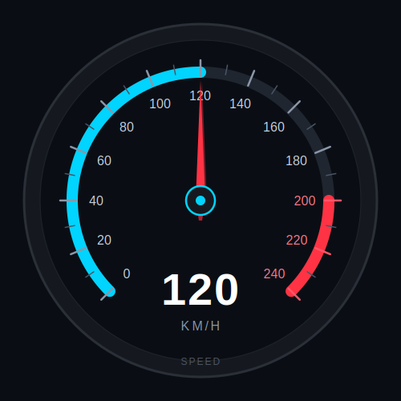

# Module 09 — Qt Gauge & Speedometer

> Build a fully custom automotive-style speedometer using Qt Widgets and `QPainter`. Learn how real instrument clusters render gauge faces, rotating needles, animated arcs, and live sensor-driven updates — and end with a reusable widget you can drop into any future HMI.

| Phase | Level | Time | Qt modules |
| --- | --- | --- | --- |
| Phase 3 — Advanced Qt | Advanced | 3 hours | Qt Core · Qt GUI · Qt Widgets |

---

  

---

## Table of Contents

1. [Why Custom Gauges Matter](#1-why-custom-gauges-matter)
2. [Anatomy of a Gauge](#2-anatomy-of-a-gauge)
3. [Gauge API Design](#3-gauge-api-design)
4. [Drawing the Gauge Face](#4-drawing-the-gauge-face)
5. [Tick Marks and Labels](#5-tick-marks-and-labels)
6. [Rotating Needle Design](#6-rotating-needle-design)
7. [Smooth Needle Animation](#7-smooth-needle-animation)
8. [Complete Speedometer Widget](#8-complete-speedometer-widget)
9. [Wiring Sensor Data to the Gauge](#9-wiring-sensor-data-to-the-gauge)
10. [Gauge Variations](#10-gauge-variations)
11. [Themes and Styling](#11-themes-and-styling)
12. [Official Documentation Map](#12-official-documentation-map)
13. [Reference Videos](#13-reference-videos)
14. [Common Errors & Fixes](#14-common-errors--fixes)

---

## 1. Why Custom Gauges Matter

Modern automotive HMIs rarely use stock widgets for the dashboard elements that matter most. Speedometers, tachometers, battery meters, fuel gauges, and temperature dials are all custom-painted widgets built specifically for each vehicle's visual identity. There is no `QSpeedometer` class in Qt — and no OEM would want one. Every brand needs control over every pixel.

Custom gauges give you:

- **Real-time telemetry visualisation** — speed, RPM, battery state, motor temperature, all updating at 10–60 Hz
- **Smooth animated feedback** — the needle never snaps; it sweeps, the way the analogue gauge it replaces would have moved
- **Scalable vector rendering** — one widget looks crisp on a 7-inch cluster, a 12.3-inch IVI, and a 4 K passenger display
- **Brand-specific styling** — Eco green, Sport red, Snow blue, all from the same widget class
- **Embedded-friendly UI** — `QPainter` on a software framebuffer runs comfortably on i.MX 8 and Renesas R-Car parts

Qt Widgets + `QPainter` give you complete control over every pixel rendered on screen, while the rest of Qt (signals/slots, animations, properties) handles the wiring so the gauge stays clean to use from the outside.

---

## 2. Anatomy of a Gauge

Every automotive speedometer — and almost every analogue gauge — is built from the same six core parts. Before writing a line of code, learn the names. The rest of this module assumes them.

  

| Component | Purpose | `QPainter` technique |
| --- | --- | --- |
| **Face** | Circular background layer; the dial's "metal" | `drawEllipse` with brush or gradient |
| **Track** | Base arc showing the full range, dimmed | `drawArc` over the full sweep |
| **Fill Arc** | Active progress arc — grows with the value | `drawArc` from start to `value → angle` |
| **Tick Marks** | Visual speed divisions, major and minor | `drawLine` inside a `save/rotate/restore` loop |
| **Needle** | Rotating current-value indicator | `QPolygon` drawn after `translate + rotate` |
| **Readout** | Numeric digital display in the centre | `drawText` with a large bold font |

Two more parts you'll often add:

- **Centre hub** — the small cap that covers the needle's pivot, drawn *after* the needle so it hides the join
- **Units label** — "KM/H" or "MPH" under the digital readout, switchable at runtime

Once you can name every part, drawing them is just a sequence of `QPainter` calls in the right order: face → track → fill → ticks → labels → needle → hub → readout.

---

## 3. Gauge API Design

Before drawing anything, design the widget from the **outside first**. Decide what the rest of the application will see — what signals it emits, what slots it accepts, what properties expose customisation — and only then think about pixels.

A clean speedometer API usually exposes:

| Element | Type | Purpose |
| --- | --- | --- |
| `setSpeed(int)` | public slot | Receives new speed values from any source |
| `speedChanged(int)` | signal | Notifies listeners when the displayed value updates |
| `targetSpeed` | member | The latest *raw* value from the sensor |
| `displayedSpeed` | `Q_PROPERTY` | The *animated* value the needle is actually showing |
| `maxSpeed`, `redZoneStart`, `units` | `Q_PROPERTY` | Customisation knobs for OEM theming |

The most important principle in this module:

> **Separate the real sensor value from the displayed animated value.**

The sensor may jitter 5 km/h up and down at 10 Hz. The needle should glide. The two values are different things — give them different variables.

### Widget API skeleton

    class SpeedometerWidget : public QWidget {
        Q_OBJECT
        Q_PROPERTY(int displayedSpeed READ displayedSpeed
                                      WRITE setDisplayedSpeed
                                      NOTIFY speedChanged)
        Q_PROPERTY(int maxSpeed       MEMBER m_maxSpeed)
        Q_PROPERTY(int redZoneStart   MEMBER m_redZoneStart)

    public:
        explicit SpeedometerWidget(QWidget *parent = nullptr);

    public slots:
        void setSpeed(int kmh);             // entry point from sensors

    signals:
        void speedChanged(int kmh);         // emitted on every frame

    protected:
        void paintEvent(QPaintEvent *) override;

    private:
        int  m_targetSpeed   = 0;
        int  m_displayedSpeed = 0;
        int  m_maxSpeed      = 240;
        int  m_redZoneStart  = 200;
        QPropertyAnimation *m_anim;
    };

That's the entire public surface. Everything inside `paintEvent` is implementation detail.

> 📘 **Reference:** [Qt Property System (Qt 6.1)](https://doc.qt.io/archives/qt-6.1/properties.html) · [Q_PROPERTY macro](https://doc.qt.io/archives/qt-6.1/qobject.html#Q_PROPERTY)

---

## 4. Drawing the Gauge Face

The gauge face is the base layer of the speedometer — drawn first, sat below everything else. Typical elements include a circular outer ring, a subtle gradient background, an inner shadow, an optional border glow, and the dim track arc that shows the full speed range.

All drawing happens inside `paintEvent`, and the very first line should always be:

    QPainter painter(this);
    painter.setRenderHint(QPainter::Antialiasing);

Without antialiasing, the circles and arcs look jagged — unacceptable on any modern display. With it, you get the smooth curves drivers expect.

### Skeleton

    void SpeedometerWidget::paintEvent(QPaintEvent *) {
        QPainter p(this);
        p.setRenderHint(QPainter::Antialiasing);

        const QPoint centre = rect().center();
        const int    radius = qMin(width(), height()) / 2 - 20;

        // Outer bezel
        p.setPen(QPen(QColor("#2a2f38"), 3));
        p.setBrush(QColor("#15191f"));
        p.drawEllipse(centre, radius + 20, radius + 20);

        // Dim track arc — drawn behind the fill arc
        p.setPen(QPen(QColor("#1f2630"), 14, Qt::SolidLine, Qt::RoundCap));
        const QRect arcRect(centre.x() - radius, centre.y() - radius,
                            radius * 2, radius * 2);
        p.drawArc(arcRect, 225 * 16, -270 * 16);
    }

A couple of `QPainter` quirks worth remembering:

- All `drawArc`, `drawChord`, and `drawPie` angles are in **sixteenths of a degree**. `225 * 16` means "start at 225°", and `-270 * 16` means "sweep 270° clockwise". Forget the `× 16` and your arcs come out comically tiny.
- The Y axis points **down**. Positive rotation is clockwise.
- Pen widths apply to strokes, brushes apply to fills. `drawArc` only ever strokes — you can't fill an arc.

The gauge face defines the entire visual identity of the dashboard. Get this layer right and the rest is decoration.

> 📘 **Reference:** [QPainter (Qt 6.1)](https://doc.qt.io/archives/qt-6.1/qpainter.html) · [QPainter::drawArc](https://doc.qt.io/archives/qt-6.1/qpainter.html#drawArc) · [Qt Paint System](https://doc.qt.io/archives/qt-6.1/paintsystem.html)

---

## 5. Tick Marks and Labels

Tick marks visually divide the speed range. A typical automotive layout uses:

| Type | Spacing | Length |
| --- | --- | --- |
| **Major tick** | every 20 km/h | 20 px |
| **Minor tick** | every 10 km/h | 12 px |
| **Numeric label** | at each major tick | text |

Both ticks and labels are positioned by angle. For a 0–240 km/h gauge with a 270° sweep starting at the lower-left (−135°) and ending at the lower-right (+135°), each km/h is worth `270 / 240 = 1.125°`.

The cleanest way to place a tick is the **save / rotate / restore** trick — let `QPainter` do the trigonometry for you:

    for (int v = 0; v <= m_maxSpeed; v += 20) {
        const double angle = -135.0 + 270.0 * v / m_maxSpeed;

        p.save();
            p.translate(centre);
            p.rotate(angle);
            p.setPen(QPen(v >= m_redZoneStart ? "#ff5566" : "#8a96a8", 2.5));
            p.drawLine(0, -radius - 5, 0, -radius + 15);
        p.restore();
    }

The `save()` and `restore()` calls bracket the transformation so it never leaks into the next iteration of the loop, or into the rest of `paintEvent`. Forgetting them is the most common gauge-drawing bug — and the most confusing to debug, because everything afterwards mysteriously appears rotated.

Numeric labels need a small bit of trigonometry because text doesn't rotate well — you want each number drawn upright, just *positioned* at the angle:

    for (int v = 0; v <= m_maxSpeed; v += 20) {
        const double angle = -135.0 + 270.0 * v / m_maxSpeed;
        const double rad   = qDegreesToRadians(angle);
        const QPoint pos   = centre + QPoint(int((radius - 30) * std::sin(rad)),
                                             int(-(radius - 30) * std::cos(rad)));
        p.drawText(QRect(pos.x() - 20, pos.y() - 10, 40, 20),
                   Qt::AlignCenter, QString::number(v));
    }

Challenges to expect:

- **Angle mapping** — get the start angle and direction right or the gauge runs backwards
- **Text alignment** — `Qt::AlignCenter` inside a small `QRect` keeps numbers tidy
- **Rotation compensation** — never call `p.rotate()` and then `p.drawText()` unless you want sideways digits
- **Dynamic scaling** — recompute `radius` from `width()/height()` every frame so the gauge reflows when resized

---

## 6. Rotating Needle Design

The needle is the central animated component — and the place where the save/rotate/restore pattern earns its keep.

Instead of recomputing the needle's tip and base coordinates with `sin`/`cos` every frame, draw it once *pointing straight up*, then let the painter rotate it into position:

1. Move the painter origin to the gauge centre with `translate(centre)`
2. Rotate the coordinate system by the speed-to-angle mapping
3. Draw the needle at angle 0 — pointing up — as a polygon

### Rotation snippet

    p.save();
        p.translate(centre);
        const double angle = -135.0 + 270.0 * m_displayedSpeed / m_maxSpeed;
        p.rotate(angle);

        QPolygon needle;
        needle << QPoint(  0, -radius + 30)   // tip
               << QPoint( -4, 0)              // left base
               << QPoint(  0, 15)             // short tail
               << QPoint(  4, 0);             // right base

        p.setBrush(QColor("#ff3344"));
        p.setPen(Qt::NoPen);
        p.drawPolygon(needle);
    p.restore();

Order matters: dial face → ticks → labels → fill arc → **needle** → centre hub. Each layer covers the seams of the one beneath. The centre hub is always drawn *last* over the needle's base so the pivot looks clean.

Typical needle styles you'll see across automotive HMIs:

- **Thin racing needle** — narrow, full-length, red. Sports cars.
- **Polygon arrow** — wider base tapering to a point. Sedans.
- **Minimal EV pointer** — short stub from the rim only. Tesla / Lucid style.
- **Glow-effect needle** — coloured fill + a translucent halo behind. Concept-car styling.

All four are the same polygon math — only the coordinates and brush change.

---

## 7. Smooth Needle Animation

Directly jumping between sensor values looks broken. Real instrument clusters glide.

| Step | What happens |
| --- | --- |
| **1.** Sensor updates | `setSpeed()` writes a new value into `m_targetSpeed` |
| **2.** Animation kicks in | `QPropertyAnimation` interpolates `m_displayedSpeed` toward `m_targetSpeed` over ~200 ms |
| **3.** Widget repaints | Each animation frame calls `update()`, the needle sweeps |

`QPropertyAnimation` is the idiomatic Qt way to do this — it integrates with the property system, supports easing curves, and doesn't fight the event loop.

    void SpeedometerWidget::setSpeed(int kmh) {
        if (kmh == m_targetSpeed) return;            // redundancy gate
        m_targetSpeed = kmh;

        m_anim->stop();
        m_anim->setStartValue(m_displayedSpeed);
        m_anim->setEndValue(m_targetSpeed);
        m_anim->setDuration(200);
        m_anim->setEasingCurve(QEasingCurve::OutCubic);
        m_anim->start();
    }

    void SpeedometerWidget::setDisplayedSpeed(int v) {
        m_displayedSpeed = v;
        update();                                    // schedule repaint
        emit speedChanged(v);
    }

The `QEasingCurve::OutCubic` curve gives the needle that satisfying "decelerate into target" feel, much more lifelike than a linear interpolation.

For lightweight cases — or if you specifically want a fixed-step animation — you can drive the same `m_displayedSpeed` update from a `QTimer` at 60 Hz instead:

    QTimer *timer = new QTimer(this);
    connect(timer, &QTimer::timeout, this, [this] {
        if (m_displayedSpeed == m_targetSpeed) return;
        m_displayedSpeed += (m_targetSpeed > m_displayedSpeed) ? 1 : -1;
        update();
    });
    timer->start(16);   // ~60 fps

Both approaches create the smooth movement seen in real clusters. `QPropertyAnimation` is generally cleaner; `QTimer` gives you frame-by-frame control if you need it.

> 📘 **Reference:** [QPropertyAnimation (Qt 6.1)](https://doc.qt.io/archives/qt-6.1/qpropertyanimation.html) · [QEasingCurve (Qt 6.1)](https://doc.qt.io/archives/qt-6.1/qeasingcurve.html) · [Animation Framework Overview](https://doc.qt.io/archives/qt-6.1/animation-overview.html) · [QTimer (Qt 6.1)](https://doc.qt.io/archives/qt-6.1/qtimer.html)

---

## 8. Complete Speedometer Widget

A finished speedometer widget brings together everything from §4–7:

- Gauge face with bezel and track arc
- Tick marks with red-zone highlighting
- Numeric labels at every major tick
- Fill arc that grows with the value
- Rotating needle on top
- Centre hub covering the pivot
- Digital readout and units label

Once complete, the widget is a reusable component. You can:

- Drop it into any `QHBoxLayout` / `QVBoxLayout` / `QGridLayout`
- Reuse it across multiple HMI projects without modification
- Combine it with a tachometer, fuel bar, and warning panel into a full cluster
- Theme it from QSS without touching any C++

Treat the class as a black box from the outside. Any `QObject` that emits `speedChanged(int)` can drive it; any layout can host it. That's good widget design.

---

## 9. Wiring Sensor Data to the Gauge

A clean signal/slot API makes integration trivial. The widget doesn't care where the speed comes from — only that *something* emits `speedChanged(int)` at it.

Typical data sources in automotive projects:

| Source | Notes |
| --- | --- |
| **CAN bus** | Real production data, parsed via SocketCAN or a vendor library, wrapped in a `QObject` |
| **Serial device** | OBD-II adapter or microcontroller streaming over UART |
| **`SensorWorker` thread** | Heavy parsing in a background thread, emits to the main thread |
| **Simulated telemetry** | A `QTimer` walking a value up and down for development & demos |
| **MQTT / WebSocket stream** | Telemetry replay or remote test rigs |

The integration pattern is identical for all of them — one `connect()` call:

    SpeedometerWidget speedo;
    SpeedSource       source;        // any QObject emitting speedChanged(int)

    QObject::connect(&source, &SpeedSource::speedChanged,
                     &speedo,  &SpeedometerWidget::setSpeed);

    speedo.show();

A minimal simulator for development:

    class SpeedSource : public QObject {
        Q_OBJECT
    public:
        explicit SpeedSource(QObject *parent = nullptr) : QObject(parent) {
            auto *t = new QTimer(this);
            connect(t, &QTimer::timeout, this, &SpeedSource::tick);
            t->start(100);     // 10 Hz — matches a typical CAN cycle
        }
    signals:
        void speedChanged(int kmh);
    private slots:
        void tick() {
            m_speed += m_direction * 2;
            if (m_speed >= 200) m_direction = -1;
            if (m_speed <= 0)   m_direction = +1;
            emit speedChanged(m_speed);
        }
    private:
        int m_speed = 0, m_direction = +1;
    };

When you swap `SpeedSource` for a real CAN reader, **the widget code doesn't change** — that's the whole point of designing the API from the outside first.

> 📘 **Reference:** [Signals & Slots (Qt 6.1)](https://doc.qt.io/archives/qt-6.1/signalsandslots.html) · [QObject (Qt 6.1)](https://doc.qt.io/archives/qt-6.1/qobject.html)

---

## 10. Gauge Variations

The same architecture you used for the speedometer powers most of the other dashboard components. Once you've built one gauge, the others are configuration changes — different range, different colours, different units.

| Gauge type | Range | Red zone | Typical use |
| --- | --- | --- | --- |
| **Tachometer** | 0–8 000 RPM | 6 500+ | ICE engine RPM |
| **Fuel gauge** | 0–100 % | low fuel below 15 % | Tank level |
| **Temperature gauge** | 50–130 °C | 110+ | Coolant temp |
| **Battery gauge** | 0–100 % SoC | low SoC below 20 % | EV state of charge |
| **Oil pressure** | 0–10 bar | varies | ICE oil pressure |
| **Pressure gauge** | application-specific | application-specific | Industrial / heavy machinery |

After building three or four of these you'll notice every one starts the same way: paintEvent → face → ticks → labels → fill → needle → readout. That's the cue to extract the shared logic into a base class:

    class BaseGauge : public QWidget {
        Q_OBJECT
    public:
        // Common properties — range, redZone, units, colours
    protected:
        // Common paintEvent that calls virtual hooks:
        virtual void drawFace(QPainter &p)   = 0;
        virtual void drawTicks(QPainter &p)  = 0;
        virtual void drawNeedle(QPainter &p) = 0;
    };

    class SpeedometerWidget : public BaseGauge { /* overrides */ };
    class TachometerWidget  : public BaseGauge { /* overrides */ };
    class FuelGaugeWidget   : public BaseGauge { /* overrides */ };

This is exactly the structure real OEM cluster codebases use. Don't extract it on day one — wait until you have at least two concrete gauges so you can see what they actually share.

---

## 11. Themes and Styling

Automotive HMIs lean heavily on visual styling — and the same cluster code is usually skinned for ten different vehicle models. Popular dashboard styles:

- **Dark Performance** — black background, red/cyan accents, sharp typography
- **EV Minimal** — flat colours, large digits, no analogue needle at all on some models
- **Neon Cyberpunk** — saturated cyan / magenta, glow effects everywhere
- **Sport Redline** — animated red zone that pulses when crossed
- **Glassmorphism** — translucent panels with blur, common on luxury IVI

Customisable elements you'll typically expose:

- **Arc gradients** (`QLinearGradient`, `QConicalGradient` for the fill arc)
- **Needle colour & glow** (paint a translucent halo before the solid needle)
- **Tick density & length** (every 5/10/20 of the unit)
- **Font family, weight, and size** for digits and labels
- **Warning indicators** (red border flash when in the red zone)

The cleanest way to make these themeable is via `Q_PROPERTY` + Qt Style Sheets (covered in Module 07):

    Q_PROPERTY(QColor arcColor    READ arcColor    WRITE setArcColor)
    Q_PROPERTY(QColor needleColor READ needleColor WRITE setNeedleColor)
    Q_PROPERTY(int    maxSpeed    READ maxSpeed    WRITE setMaxSpeed)

…then in a `.qss` file:

    SpeedometerWidget#mainSpeedo {
        qproperty-arcColor:    #00ffaa;
        qproperty-needleColor: #ff3344;
        qproperty-maxSpeed:    320;
    }

That's how an OEM team skins the same widget for ten vehicle variants without touching the C++.

For modern cluster visuals, `QLinearGradient`, alpha blending, and the `QPainter::CompositionMode_*` flags do most of the heavy lifting. Reach for them before you reach for OpenGL.

> 📘 **Reference:** [Qt Style Sheets (Qt 6.1)](https://doc.qt.io/archives/qt-6.1/stylesheet.html) · [QLinearGradient](https://doc.qt.io/archives/qt-6.1/qlineargradient.html) · [QConicalGradient](https://doc.qt.io/archives/qt-6.1/qconicalgradient.html)

---

## 12. Official Documentation Map

All links point to **Qt 6.1**. Equivalent pages exist at `doc.qt.io/qt-5/...` for Qt 5.15 LTS.

### Core painting

| Resource | Purpose |
| --- | --- |
| [QPainter (Qt 6.1)](https://doc.qt.io/archives/qt-6.1/qpainter.html) | Main drawing API — every function used in this module |
| [Qt Paint System](https://doc.qt.io/archives/qt-6.1/paintsystem.html) | How Qt's painting backend actually works |
| [Coordinate System](https://doc.qt.io/archives/qt-6.1/coordsys.html) | Translate / rotate / scale explained with diagrams |
| [Analog Clock Example](https://doc.qt.io/archives/qt-6.1/qtwidgets-widgets-analogclock-example.html) | The canonical "rotating hand" reference — read this first |

### Widgets and styling

| Resource | Purpose |
| --- | --- |
| [Qt Widgets Index](https://doc.qt.io/archives/qt-6.1/qtwidgets-index.html) | Module overview |
| [QPen](https://doc.qt.io/archives/qt-6.1/qpen.html) | Outline / stroke styling |
| [QBrush](https://doc.qt.io/archives/qt-6.1/qbrush.html) | Fill styling, gradients, patterns |
| [QPolygon](https://doc.qt.io/archives/qt-6.1/qpolygon.html) | Used for the needle |
| [Qt Style Sheets](https://doc.qt.io/archives/qt-6.1/stylesheet.html) | QSS reference for themable gauges |

### Animation & timing

| Resource | Purpose |
| --- | --- |
| [QPropertyAnimation](https://doc.qt.io/archives/qt-6.1/qpropertyanimation.html) | Recommended way to animate the needle |
| [QEasingCurve](https://doc.qt.io/archives/qt-6.1/qeasingcurve.html) | All easing presets with example graphs |
| [Animation Framework Overview](https://doc.qt.io/archives/qt-6.1/animation-overview.html) | Big-picture view of Qt's animation system |
| [QTimer](https://doc.qt.io/archives/qt-6.1/qtimer.html) | Frame-by-frame control alternative |

### Property system

| Resource | Purpose |
| --- | --- |
| [Qt Property System](https://doc.qt.io/archives/qt-6.1/properties.html) | `Q_PROPERTY` macro explained |
| [The Meta-Object System](https://doc.qt.io/archives/qt-6.1/metaobjects.html) | What `moc` generates and why it matters |

### Automotive context

| Resource | Purpose |
| --- | --- |
| [Qt for Automotive](https://www.qt.io/product/automotive) | Commercial automotive offering and reference apps |
| [Qt Safe Renderer](https://doc.qt.io/QtSafeRenderer/) | ISO 26262 safe rendering for production clusters |

---

## 13. Reference Videos

Curated picks — watch the first two before you start coding.

| Video | Length | Why watch |
| --- | --- | --- |
| [Building an Analog Clock with QPainter](https://www.youtube.com/watch?v=HVL4Yz0oqYM) | ~25 min | The classic rotation example — speedometer is the same idea, different artwork |
| [Speedometer Widget in Qt — Full Build](https://www.youtube.com/watch?v=DK7Yc7i-tb4) | ~30 min | Walks through a complete speedometer project end-to-end |
| [Qt QPropertyAnimation Tutorial](https://www.youtube.com/watch?v=_RUkpZAh1Vs) | ~20 min | Smooth value interpolation, exactly what the needle needs |
| [Custom Widgets with QPainter — Step by Step](https://www.youtube.com/watch?v=GFLlnYzMnQc) | ~20 min | Reusable widget patterns matching the architecture in this module |
| [Introduction to Qt Widgets (KDAB)](https://www.youtube.com/watch?v=g7yijWiZTmI) | ~15 min | KDAB's official Qt Widgets series — production-grade reference |

Useful search terms if the links go stale:

- "Qt Speedometer Widget"
- "Qt QPainter Gauge"
- "Qt Automotive Dashboard"
- "Qt Instrument Cluster"

---

## 14. Common Errors & Fixes

### Needle points the wrong direction

Your angle formula assumes one sweep direction but you're rendering the other. Pick a convention (0 km/h at −135°, max at +135°, clockwise positive) and use it consistently in *both* the needle rotation and the fill arc. The two must agree.

### Needle jumps instead of sweeping

You're calling `update()` directly from the sensor's `speedChanged` signal without going through `QPropertyAnimation`. **Fix:** route the signal into `setSpeed()`, which animates `displayedSpeed` between `target` and `current`. Never bypass the animation.

### Labels rotate sideways

You forgot to `restore()` after `rotate()`, so the painter transform leaked into the `drawText` call afterwards. **Fix:** always wrap `translate + rotate` in `save() / restore()`. If you genuinely want rotated text, do it inside its own save/restore block.

### Arc looks jagged

Antialiasing isn't enabled. **Fix:** as the very first line of `paintEvent` after constructing the painter:

    painter.setRenderHint(QPainter::Antialiasing);

Some platforms also benefit from `QPainter::TextAntialiasing` and `QPainter::SmoothPixmapTransform`.

### UI flickers during updates

You're causing the widget to be erased and redrawn from scratch on every frame. Causes and fixes:

1. **Repainting too often** — call `update()`, not `repaint()`. `update()` coalesces requests; `repaint()` forces an immediate synchronous redraw.
2. **Allocating heavy objects in `paintEvent`** — move `QPropertyAnimation`, `QPen`, `QFont`, and similar to the constructor. `paintEvent` should only *use* them.
3. **Resetting the brush every frame on a parent** — set `setAttribute(Qt::WA_OpaquePaintEvent)` if your `paintEvent` fully repaints the widget.

### Gauge scales badly when window resized

You hard-coded dimensions. **Fix:** compute everything relative to `qMin(width(), height())` at the top of `paintEvent`. Never store a `radius` member.

### CPU usage very high

You're in a repaint loop — most often a slot connected to `update()` that itself fires `speedChanged` that fires `update()` again. **Fix:** add a redundancy gate at the top of `setSpeed()`:

    if (kmh == m_targetSpeed) return;

### Animation never stops

The animation is being restarted every time `setSpeed()` is called, even when the target hasn't changed. Same fix as above — the redundancy gate. Also confirm `QEasingCurve` isn't set to a looping variant by mistake.

### Text overlaps tick marks

The label radius is too close to the tick radius. **Fix:** position labels at `radius - 30` or so, and tighten with a `QFontMetrics` measurement if you need pixel-perfect placement.

### Widget remains blank

`paintEvent()` isn't being called. Three usual causes:

1. The class doesn't have `Q_OBJECT` and `moc` wasn't run — your virtual `paintEvent` override isn't actually registered.
2. The widget has zero size — no layout was set, or its size hint is `(0, 0)`. Call `setMinimumSize(300, 300)` or set a size policy.
3. The widget was constructed but never `show()`-n, or never added to a visible parent.

### Build error: `'QPropertyAnimation' was not declared in this scope`

Missing include. Add `#include <QPropertyAnimation>`. Same applies to `QPolygon`, `QEasingCurve`, `QLinearGradient` — each is its own header in Qt 6.

### Stylesheet `qproperty-arcColor` is ignored

The `Q_PROPERTY` is missing `NOTIFY`, or the setter doesn't call `update()`. **Fix:**

    Q_PROPERTY(QColor arcColor READ arcColor WRITE setArcColor NOTIFY arcColorChanged)

…and have `setArcColor()` call `update()` after assigning.

---

## What's Next

Once the speedometer is rendering smoothly and accepting live data, you're ready to compose it into a full cluster. Future modules build on this widget:

- **[Module 10 — Final Project: Full HMI Integration](../10-final-project/)** — combine speedometer, tachometer, fuel bar, and warning panel into a single cluster screen driven by a shared telemetry source

Beyond this training, the natural progression in a real automotive project is:

- CAN-bus integration replacing the simulator
- Multi-threaded telemetry pipelines (sensor worker → main UI thread)
- Animated dashboard transitions (drive-mode switches, theme changes)
- Full digital instrument cluster with map, ADAS warnings, media
- Embedded-Linux deployment on an i.MX or Renesas R-Car board

A worked sample project (`SpeedometerWidget` + simulator + demo `main.cpp`) lives in a subfolder next to this README — refer to it after you've absorbed the concepts above.

---

← [Previous module](../08-qtcharts/) · [Back to syllabus](../README.md) · [Next module →](../10-final-project/)
