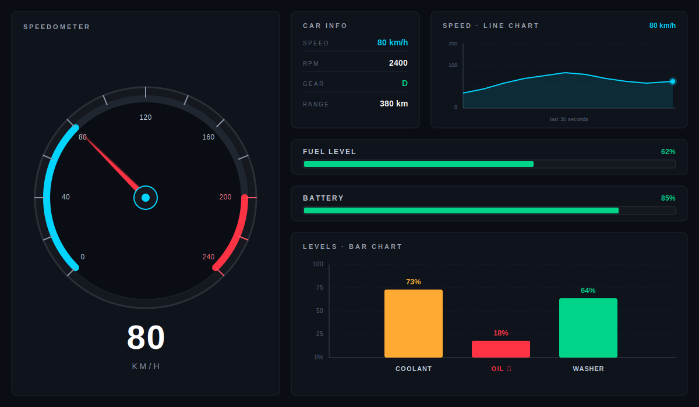

# Module 10 — Final Project: Vehicle Dashboard

> Your final project. Take every Qt concept you've learned across Modules 01–09 and integrate them into a single working **vehicle dashboard** that displays simulated telemetry in six different visual formats. This README is a **sample brief** — your job is to design, code, and ship your own version.

| Phase | Level | Time | Qt modules |
| --- | --- | --- | --- |
| Phase 4 — Final Project | Project | 1 working day (~6–8 hours) | Qt Core · Qt GUI · Qt Widgets · Qt Charts |

---

<p align="center">
  
</p>

---

## Table of Contents

1. [What You'll Build](#1-what-youll-build)
2. [Project Goals](#2-project-goals)
3. [The Six Panels — Anatomy](#3-the-six-panels--anatomy)
4. [Architecture — How the Pieces Connect](#4-architecture--how-the-pieces-connect)
5. [Module Reuse Map](#5-module-reuse-map)
6. [Suggested Build Order](#6-suggested-build-order)
7. [The Data Source](#7-the-data-source)
8. [Customization & Variations](#8-customization--variations)
9. [Submission Checklist](#9-submission-checklist)
10. [Official Documentation Map](#10-official-documentation-map)
11. [Reference Videos](#11-reference-videos)
12. [Common Errors & Fixes](#12-common-errors--fixes)

---

## 1. What You'll Build

A single-window Qt application that simulates a vehicle's instrument cluster. The window displays the **same simulated vehicle data** in **six different visual formats** at the same time — analogue gauge, digital text, live trend chart, and bar graphs. All six panels update together, driven by one data source running at 10 Hz (the typical CAN-bus cycle rate in real vehicles).

The mockup above shows the **goal**. Your version doesn't have to look identical — you can change colours, fonts, or even the layout. What matters is that the project demonstrates you can:

- Compose a real UI in Qt Designer using layouts and frames
- Promote frames to custom widgets you wrote yourself
- Connect a single signal-emitting data source to multiple consumer widgets
- Use both **standard Qt widgets** (`QProgressBar`) and **Qt Charts** (`QChartView`)
- Apply a coherent visual theme via Qt Stylesheets (QSS)
- Structure a multi-file project that someone else could pick up and extend

This is your portfolio piece. Treat it that way.

---

## 2. Project Goals

By the end of this project you should be able to confidently say:

- *"I can integrate widgets from multiple Qt modules into one cohesive application."*
- *"I can design a UI in Qt Designer and wire it to backend C++ code."*
- *"I can use the signal/slot mechanism to fan out one event to several widgets."*
- *"I can read the Qt documentation and pick the right class for a job."*
- *"I can apply a stylesheet to make a Qt application look modern and on-brand."*

If any of these still feels shaky after the project, that's the area to revisit in the corresponding module — that's the whole point of having an integration project last.

---

## 3. The Six Panels — Anatomy

Refer to the mockup above as you read each panel description.

| # | Panel | Position | Type | What it shows |
| --- | --- | --- | --- | --- |
| 1 | **Speedometer** | Full left side | Custom widget (`QPainter`) | Current speed as a rotating-needle analogue gauge with digital readout below |
| 2 | **Car Info** | Top-middle | `QLabel` grid | Speed, RPM, Gear, Range as labelled rows |
| 3 | **Speed Line Chart** | Top-right | Qt Charts `QLineSeries` | Speed history over the last 30 seconds (scrolling) |
| 4 | **Fuel Progress Bar** | Middle row | `QProgressBar` | Current fuel level (0–100 %) |
| 5 | **Battery Progress Bar** | Middle row | `QProgressBar` | Current battery state of charge (0–100 %) |
| 6 | **Levels Bar Chart** | Bottom | Qt Charts `QBarSeries` | Coolant / Oil / Washer fluid levels with health-based colours |

### Same data, different formats

This is the key teaching point of the whole project: **panels 1, 2, and 3 all show the speed value.** The needle, the digital "80 km/h" text, and the rightmost point of the line chart all move together because they're all listening to the same `speedChanged(int)` signal.

Drivers naturally cross-reference the three formats: a glance at the gauge, a check of the digital number, a peek at the chart to see if the speed is climbing or falling. Your job is to wire all three to the same source.

---

## 4. Architecture — How the Pieces Connect

Three layers — keep them strictly separated and the rest is easy.

```
┌─────────────────────────────────────────────────────────────┐
│  DATA SOURCE (one QObject, QTimer @ 10 Hz)                  │
│  signals: speedChanged(int)    rpmChanged(int)              │
│           fuelChanged(int)     batteryChanged(int)          │
│           tempChanged(int)     ...                          │
└──────────────────┬──────────────────────────────────────────┘
                   │ signals
                   ▼
┌─────────────────────────────────────────────────────────────┐
│  MAIN DIALOG (loads dashboard.ui, owns all widgets)         │
│  - Wires every signal to the right slot via connect()       │
└──┬──────────┬──────────┬───────────┬───────────┬────────────┘
   │          │          │           │           │
   ▼          ▼          ▼           ▼           ▼
┌──────┐ ┌────────┐ ┌────────┐ ┌──────────┐ ┌──────────┐
│Speed │ │Car Info│ │ Line   │ │ Progress │ │ Bar      │
│ometer│ │ labels │ │ chart  │ │  bars    │ │ chart    │
└──────┘ └────────┘ └────────┘ └──────────┘ └──────────┘
```

### The single most important design principle

> **One signal can drive many widgets.** Wire `dataSource.speedChanged` to the speedometer, the digital label *and* the line chart — three `connect()` calls, one event source.

This is why the signal/slot mechanism exists. If you find yourself manually calling `widget.setValue()` from multiple places, stop and route everything through signals instead.

---

## 5. Module Reuse Map

You've already built most of the building blocks in previous modules. Reuse, don't rewrite.

| Panel | Reuses code from | What you actually add for this project |
| --- | --- | --- |
| Speedometer | **Module 09** — `SpeedometerWidget` | Drop in the class; connect one signal |
| Car Info labels | **Module 02** (layouts) + **Module 07** (QSS) | Four `QLabel`s + four slots that call `setText()` |
| Speed Line Chart | **Module 08** — Qt Charts | Append to `QLineSeries`, scroll the X axis |
| Fuel & Battery bars | Standard `QProgressBar`, styled with **Module 07** QSS | One slot per bar that calls `setValue()` |
| Levels Bar Chart | **Module 08** — Qt Charts `QBarSeries` | Update bar set values when data changes |
| `VehicleDataSource` | **Module 05** (QTimer) + **Module 03** (signals & slots) | A small `QObject` subclass — biggest piece of new code |

If you've done the earlier modules properly, the only *new* code in this project is the data source and the wiring. Everything else is gluing existing pieces together.

---

## 6. Suggested Build Order

A working day broken into checkpoints. Adjust to your pace.

| Time | Step | What you should have at the end |
| --- | --- | --- |
| **0:00 – 0:30** | Open `dashboard.ui` from this folder in Qt Designer, study the placeholders | Empty dialog runs and shows the dark theme layout |
| **0:30 – 1:30** | Write `VehicleDataSource` class — `QTimer` + signals that emit changing speed, RPM, fuel, etc. | A class that prints values to console when its timer fires |
| **1:30 – 2:30** | Connect the data source to the **Car Info `QLabel`s** | Speed / RPM / Gear / Range update live in the dialog |
| **2:30 – 3:30** | Connect the data source to the **two `QProgressBar`s** | Fuel and battery bars animate over time |
| **3:30 – 4:30** | Promote the speedometer `QFrame` to your `SpeedometerWidget` from Module 09 | Needle sweeps in sync with the digital readout |
| **4:30 – 5:30** | Promote the line chart `QFrame` to `QChartView` and feed it a scrolling `QLineSeries` | Speed history shown live, scrolls every second |
| **5:30 – 6:30** | Promote the bar chart `QFrame` to `QChartView` and add a `QBarSeries` for the three levels | Three bars (Coolant, Oil, Washer) update with the data |
| **6:30 – 7:30** | Polish the QSS theme — colours, fonts, the warning colour when oil is low | Looks like the mockup (or your own variation) |
| **7:30 – 8:00** | Write a one-page README for your own project; record a demo screenshot or short clip | Ready to submit / present |

Don't get stuck on perfection at any step. **Get all six panels listening to the data source first, then polish.** Half-finished panels visible in the same window are infinitely better than three perfect panels and three empty boxes.

---

## 7. The Data Source

The `VehicleDataSource` class is the heart of the project — every panel reads from it. Keep it small and predictable.

### Minimum responsibilities

- Inherit from `QObject` (so it can emit signals)
- Hold a `QTimer` that ticks every 100 ms (10 Hz)
- On each tick, update internal state and emit the relevant `*Changed(int)` signals
- Expose one signal per data field: `speedChanged`, `rpmChanged`, `fuelChanged`, `batteryChanged`, `coolantChanged`, `oilChanged`, `washerChanged`, `gearChanged`, `rangeChanged`

### Suggested behaviours to simulate

A realistic-feeling simulator doesn't just emit random numbers. Try these patterns:

| Field | Behaviour |
| --- | --- |
| **Speed** | Slowly walks up and down between 0 and ~180 km/h with small random perturbations |
| **RPM** | Loosely tracks speed (proportional) |
| **Gear** | Cycles P → R → N → D → S occasionally |
| **Fuel** | Decreases by 1 % every ~30 s; resets to 100 % when empty |
| **Battery** | Stays roughly constant with small variations |
| **Coolant** | Climbs slowly when speed is high, settles when speed is low |
| **Oil** | Starts at 75 %, slowly drops over time (the mockup shows 18 % as a warning case) |
| **Range** | Decreases proportional to distance covered |

You don't need all of these — pick four or five that feel meaningful and skip the rest.

### Why one data source for everything?

If you ever need to swap the simulator for a real **CAN-bus reader** or an **OBD-II adapter**, you only change *one class*. None of the widgets care where the values come from. That's exactly how production automotive HMIs are structured.

> 📘 **Reference:** [Signals & Slots (Qt 6.1)](https://doc.qt.io/archives/qt-6.1/signalsandslots.html) · [QTimer (Qt 6.1)](https://doc.qt.io/archives/qt-6.1/qtimer.html) · [QObject (Qt 6.1)](https://doc.qt.io/archives/qt-6.1/qobject.html)

---

## 8. Customization & Variations

The mockup is a **starting point**, not a spec. Make the project your own. Some directions you can take:

### 🟢 Easy variations *(no extra learning required)*

- Change the colour palette — try an EV-style green, a luxury-car amber, or a sports red
- Switch units between km/h and mph (just multiply by 0.621)
- Replace "FUEL" with "WASHER FLUID" or any other resource
- Use bigger / smaller fonts to test how the layout reflows
- Rename "Car Info" to "Vehicle Status" or any branding you like

### 🟡 Medium extensions *(touches material from earlier modules)*

- Add a **CSV logger** (Module 06): write all sensor values to disk every second
- Add a **Pause/Resume button** that stops the simulator and freezes the dashboard
- Add a **theme toggle** that switches the QSS between "Day" and "Night" themes at runtime
- Display the **current time** in the Car Info panel using `QDateTime` + a separate `QTimer`
- Replace one of the progress bars with an **animated custom widget** (Module 04)

### 🔴 Stretch goals *(serious extra work, do these only if you finish early)*

- Replace the simulator with a **real OBD-II reader** over a USB serial port using `QSerialPort`
- Add a **second window** showing a navigation map (just a placeholder image is fine for a demo)
- Make the speedometer **theme-aware** so its colours change with the QSS theme
- **Multi-language support** — use Qt's `tr()` and provide a `.ts` translation for one extra language
- Add a small **warning panel** that flashes when oil < 20 % or coolant > 90 °C

Pick variations that interest you. Genuine enthusiasm shows in the result.

---

## 9. Submission Checklist

When you think you're done, walk through this checklist. If any item is unchecked, the project isn't ready.

### Code quality

- [ ] The project builds with `qmake` (or CMake) and runs without warnings
- [ ] No memory leaks on close — all `QObject`s have a parent, or are owned by a smart pointer
- [ ] No hardcoded magic numbers in the data source (use named constants)
- [ ] Each class is in its own `.h` / `.cpp` pair
- [ ] `.gitignore` excludes build folders, `.pro.user`, and generated files

### Functionality

- [ ] All six panels show live values that change over time
- [ ] The speedometer, Car Info, and line chart all show the *same* speed (one signal, three widgets)
- [ ] Progress bars stay within 0–100 % and update visibly
- [ ] Closing the dialog stops the timer cleanly (no "QTimer fired after QObject deleted" warnings in the console)

### UI

- [ ] The dialog opens at a sensible size and is readable on a 1280×720 screen
- [ ] Colours, fonts, and spacing feel intentional — no leftover Designer defaults
- [ ] The dark theme is applied via a stylesheet, not by setting colours per widget in C++
- [ ] Critical / warning states use a clearly different colour (e.g. red for low oil)

### Documentation

- [ ] A short `README.md` in your project's root, with: what it does, how to build it, a screenshot
- [ ] A one-paragraph description of which earlier modules' code you reused, and what's genuinely new
- [ ] At least one screenshot or animated GIF showing the dashboard running

### Demo

- [ ] You can show the dashboard running on your laptop in under 30 seconds (no fumbling for files, no "wait, let me rebuild")
- [ ] You can explain the data flow in one diagram drawn on a whiteboard or paper

---

## 10. Official Documentation Map

Everything you'll need is already linked in the earlier modules' READMEs. The new things for this project:

### Qt Charts

| Resource | Purpose |
| --- | --- |
| [Qt Charts Index (Qt 6.1)](https://doc.qt.io/archives/qt-6.1/qtcharts-index.html) | Top-level module overview |
| [QChartView](https://doc.qt.io/archives/qt-6.1/qchartview.html) | The widget you promote `QFrame` to |
| [QLineSeries](https://doc.qt.io/archives/qt-6.1/qlineseries.html) | The line for the speed history chart |
| [QBarSeries](https://doc.qt.io/archives/qt-6.1/qbarseries.html) | The bars for the levels chart |
| [QBarSet](https://doc.qt.io/archives/qt-6.1/qbarset.html) | Each bar inside a `QBarSeries` |
| [Qt Charts Examples](https://doc.qt.io/archives/qt-6.1/qtcharts-examples.html) | Working code for every chart type |

### Other useful references for this project

| Resource | Purpose |
| --- | --- |
| [QProgressBar (Qt 6.1)](https://doc.qt.io/archives/qt-6.1/qprogressbar.html) | The fuel and battery bars |
| [Qt Style Sheets (Qt 6.1)](https://doc.qt.io/archives/qt-6.1/stylesheet.html) | Theming the whole dashboard |
| [Customizing QProgressBar](https://doc.qt.io/archives/qt-6.1/stylesheet-examples.html#customizing-qprogressbar) | How to style the progress bars to match the dark theme |
| [Promoting Widgets in Designer](https://doc.qt.io/archives/qt-6.1/designer-using-custom-widgets.html) | How to turn a `QFrame` into your custom widget |

---

## 11. Reference Videos

| Video | Length | Why watch |
| --- | --- | --- |
| [Qt Charts — Line Chart Tutorial](https://www.youtube.com/watch?v=Hldym8hgF_4) | ~15 min | The line chart panel from scratch |
| [Qt Charts — Bar Chart Tutorial](https://www.youtube.com/watch?v=oLZHSx5Bk2A) | ~12 min | The bar chart panel |
| [Promoting Widgets in Qt Designer](https://www.youtube.com/watch?v=X116W8Uk9Wk) | ~10 min | How to swap a placeholder `QFrame` for your custom class |
| [Building Real-Time Dashboards in Qt](https://www.youtube.com/watch?v=DK7Yc7i-tb4) | ~25 min | End-to-end dashboard, same architecture pattern as this project |
| [Qt Stylesheets Crash Course](https://www.youtube.com/watch?v=_RUkpZAh1Vs) | ~15 min | Polishing the theme |

Useful search terms if links go stale: *"Qt 6 QChartView tutorial"*, *"Qt promote widget designer"*, *"Qt dashboard QSS dark theme"*.

---

## 12. Common Errors & Fixes

### Line chart shows no data at all

You created the `QLineSeries` but forgot to add it to the `QChart`, or you forgot to attach the chart's axes. **Fix:** every chart needs `chart->addSeries(series)` + at least one X axis and one Y axis attached via `chart->setAxisX(...)` and `chart->setAxisY(...)`.

### Progress bar value updates in the console but the bar doesn't move

You're calling `setValue()` on the wrong object — typically a local copy instead of the widget owned by `ui`. **Fix:** always go through `ui->progressBar_fuel->setValue(...)` and confirm `ui->setupUi(this)` was called in the constructor.

### Custom speedometer widget shows blank where the frame used to be

The `QFrame` was promoted but the header path or class name in the *Promote to…* dialog doesn't match. **Fix:** open the `.ui` file in a text editor, find the `<customwidgets>` block, and check that `<class>` matches your widget's exact class name and `<header>` points to its `.h` file relative to the `.ui` file.

### "QObject: Cannot create children for a parent that is in a different thread"

You created a `QTimer` in one thread and started it from another. **Fix:** create and start the timer in the same thread — usually the main thread is fine for this project. You don't need multi-threading.

### Stylesheet only partially applied

Cascade conflict — a parent widget overrides a child's stylesheet, or you set `setStyleSheet()` in C++ on one widget and in the `.ui` file on its parent. **Fix:** put **all** styling in one place. Either the dialog's stylesheet in Designer *or* a single `.qss` file loaded at startup, not both.

### "QTimer: QTimer can only be used with threads started with QThread"

You're trying to use a timer with `std::thread` instead of `QThread`. For this project, never start a `std::thread` — use Qt's own threading or, simpler, just stay on the main thread.

### Bar chart bars don't change colour when value crosses a threshold

`QBarSet`'s colour is set once at construction and doesn't auto-update. **Fix:** in your slot that updates the bar value, also call `barSet->setColor(...)` based on the new value (green/amber/red rules).

### Speedometer needle moves but the line chart doesn't

Only one signal is connected. **Fix:** verify you have **three** `connect()` calls for the speed signal (one for the speedometer's `setSpeed`, one for the `QLabel`'s `setText`, one for the line chart's append slot). Use `qDebug() << "speed signal fired:" << v;` inside the slot to confirm each is wired.

### Memory keeps growing while the app runs

The line chart appends points forever without removing old ones. **Fix:** after appending, also call `series->remove(0)` once the series has more than ~300 points. A scrolling chart is fixed-size by design.

### "ui_dashboard.h: No such file or directory"

The `.ui` file wasn't listed under `FORMS +=` in the `.pro` file. **Fix:** add `FORMS += dashboard.ui` and re-run qmake (`Build → Run qmake` in Qt Creator).

### App freezes for a moment every time the timer fires

You're doing heavy work (file I/O, large computation) inside the slot connected to the timer. **Fix:** move heavy work to a `QThread` or a `QtConcurrent` task; the slot fired by the main timer should only push values to widgets, never wait.

---

## What's Next

You've finished the training. Beyond this point, the natural progression depends on what you want to do with Qt:

- **Automotive HMI specialisation** — learn Qt for Automotive, Qt Safe Renderer, and CAN-bus integration. Read [Qt Automotive Suite](https://www.qt.io/product/automotive) and start contributing to open-source instrument-cluster demos.
- **Embedded systems** — learn Qt for Device Creation, cross-compile for i.MX or Renesas R-Car, and explore Yocto-based Linux builds.
- **Cross-platform desktop apps** — pivot to QML / Qt Quick for richer animations and modern fluid UIs.
- **Mobile** — Qt builds for Android and iOS too. Take the dashboard you just made and run it on a phone.

Whatever direction, the foundation you've built across Modules 01–10 is exactly what every Qt engineer relies on every day.

---

← [Previous module](../09-qt-gauge-speedometer/) · [Back to syllabus](../README.md) · 🎉 **You've reached the end!**